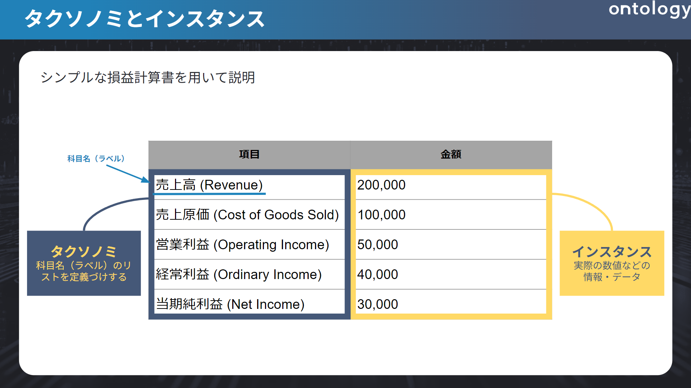
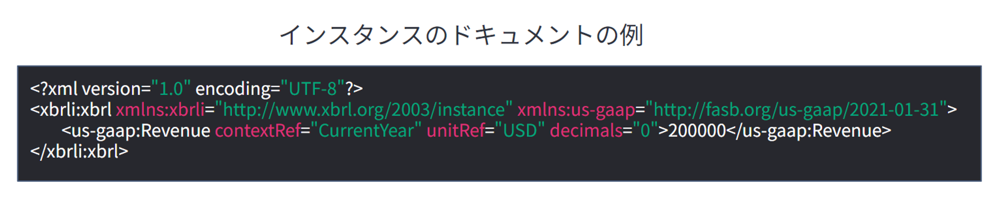
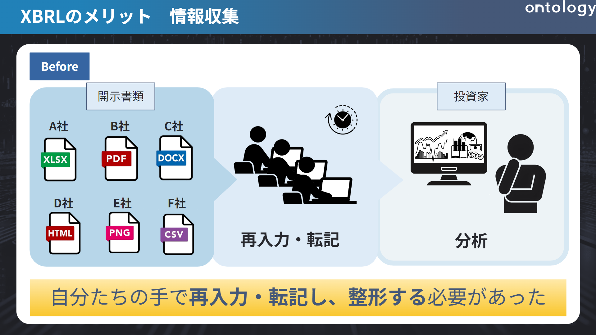
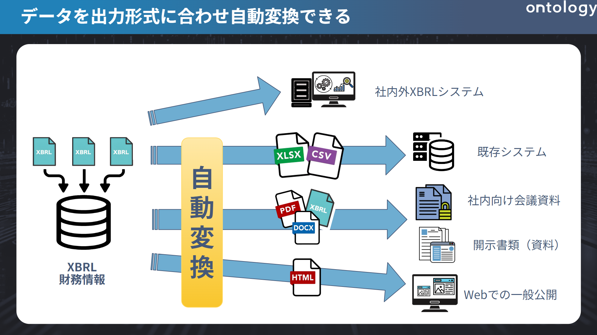

# 本章の目的

本章では、

- そもそもXBRLとはどういったものなのか。
- XBRLだと何が嬉しいのか
- XBRLの注意点

の3つを軸に大まかな概要を解説します。

## XBRLとは

XBRLとは財務報告をするための情報を**誰もがまとめやすく、拡散しやすく、利用しやすい**ように国際的に標準化された電子開示に適したコンピュータ言語です。

XML \*¹ というメタ言語をベース作られ、財務情報を記述に特化しています。

名前は「eXtensible Business Reporting Language」の略で、「拡張可能な事業報告言語」を意味します。

すごく簡単に言うと、決まった用紙に情報を埋めそれ以外の企業独自の事柄も追記できる枠組みのようなものです。同じ形式でデータ管理することでプログラムでたくさんの企業の情報を一気に取って来て財務分析ができたり、毎回0から開示書類を作成しなくてよいといった恩恵があります。

作成者側のメリットとしては、作られたフォーマットに企業情報を項目として入力するだけで報告書を作成することができます。
利用者側のメリットとしては、有報であればEDINETでワンクリックでダウンロードでき、それを様々な形式に簡単に変換できるため、Excelで分析したりPDFなどドキュメントとして社外に発表することも容易になっています。

---

\*１　様々なデータを記述するために用いるマークアップ言語を開発するためのメタ言語。

## XBRLの特徴

XBRLの特徴として**タクソノミ**と**インスタンス**という二つによって構成されています。

それぞれについて詳しくは次の記事で掘り下げるのでここでは簡単な概要のみ説明します。

現状で完全に理解していなくても大丈夫です。なんとなくイメージだけ持っていてください。

タクソノミとインスタンスを一言で表すと、
**タクソノミはひな型**、**インスタンスはその中身のデータ**といったイメージです。

画像１

(1) タクソノミ

タクソノミとは、英語で「Taxonomy」で「分類」という意味し、情報・データなどの階層構造で整理したものを指します。

この要素はをタグと言い、このタグの構造と意味を定義するものこそがタクソノミといいます。

そのため要素ひとつひとつに対して項目（名称）を定義し紐付けるものがタクソノミというわけです。

このタグを指定することで、ぱっと見の名称が異なっていても本質的な意味（タグ）が同じもの同士を比較したり、複数の企業からその情報を引っ張って来ることができるのです。

(2) インスタンス

インスタンスとは、英語で「Instance」で「実例」などを意味します。

XBRLにおけるインスタンスは、タクソノミで定義したひな型に対し、**実際の情報・データそのもの**を指します。

以下の画像を参照して実際にどうインスタンスが入っているかのイメージをつけてもらいます。

画像２

タグは<>記号であらわされます。

二つ一組になっており、初めは「<~>」、終わりは「</~>」とスラッシュが入ります。

この間の要素こそが中身の情報を表しています。

HTMLなどに触れたことがある方はイメージしやすいかと思います。

今回であれば、少し見づらいですが、書き始めが頭一つ引っ込んでいる <us-gaap:Revenue … decimales=”0></us-gaap:Revenue> がタグです。

そして、「200000」がインスタンス（実際の情報・データ）というわけです。

インスタンスでは数値のデータはもちろん、テキストデータも存在します。

最近ではこのテキストデータを用いた分析等のニーズも増えています。

例えば公開されている研究だと,

”渡部 美紀子(2022年)「Covid-19パンデミックに関する有価証券報告書「事業等のリスク」の記載の変化」、『危険と管理』、53巻、pp.112-128.”

などがあり、「COVID-19が発生してから2021年３月まで２度の決算を迎えた３月決算企業の有価証券報告書「事業等のリスク」への記載内容の変化を通して、日本企業のCOVID-19に対する情報開示の変遷」（渡部 2022 p.112）についての考察を目的として、研究がされています。

これらのような、

    ”「事業等のリスク」や「ESG項目」などのテキストデータの変化に応じて「業績」や「株価」の数値にも影響が及ぼされているのではないか”

というような分析が行われています。

## XBRLのメリット

XBRLが出てくる前は、財務報告書類は企業ごとに紙媒体で作成されており、企業にとって非常に手間やコストのかかる作業となっていました。
さらには紙媒体で作成されている情報では二次利用\*²は困難でした。

しかし、現在ではXBRLの登場によりこれらのデメリットは解消され、むしろそれらは以下のようなメリットになりました。

XBRLはタクソノミでタグを指定することにより、

- ひな型に項目（インスタンス）を入力するだけで書類を作成できる作成コストの大幅カット
- EDINETなどで簡単に様々な形式でダウンロードができる流通の良さ
- タグで情報を紐づけているためファイル形式を変換し二次利用がしやすい

といったことを実現させました。

これらを大きく分けて3者の立場に立って詳しく説明します。

---

\*２　情報のファイル形式を変え利用すること。例えば、ネットでの公開、研修用の教材、既存システムで使用されるがそれぞれ適した形式が異なる。

(1) 利用者へのメリット

利用者というのは**投資者**、**アナリスト**、**情報ベンダー**などを指し、この本を読んでくださっている方のうち、9割ほどはおそらくここに該当する方でしょう。

どの企業の調子がいいのか、これから良くなっていく企業はどこなのかを判断するための材料として有報を見てその他の多くの企業と比べることを目的とされてる方たちです。

利用者は開示された資料を見て、手動で再入力・転記することで情報を手元に置いていました。

ご想像の通り、これでは時間もかかるのにミスが生じやすく、確認作業の負担も大きくなってしまいます。このような状況ですと分析どころではありません。

画像３\*³

そこで、XBRLを用いると、システムが自動的に情報を認識でき、整合性チェックの機能があるためミスやエラー防止対策がなされ、情報の品質と透明性が向上しました。

これにより、迅速に情報を加工・分析することが用意となりました。

画像４\*³

---

\*３　画像すべては以下を参考にし、筆者が作成したもの。

[適時開示情報のXBRL化 | 日本取引所グループ](https://www.jpx.co.jp/equities/listing/disclosure/xbrl/02.html)

(2) 作成者へのメリット

主に**上場企業**などXBRLを用いて書類を作成する人を指します。

例えば、財務情報は年度ごとや組織・業種ごとで文書構造や項目、計算式などが大きく異なることはよくあります。

これらを0の状態から有報などを毎回作成するとなると（時間もお金も）作成コストが莫大にかかってしまいます。

開示書類は金融庁によるEDINETの稼働により、全面XBRL化されました。

開示書類の作成支援システムとして、主に宝印刷のX-Smartや、プロネクサスのプロネクサスワークスの2種類があります。これらを使用することで、WordのようなUIを用いて数値や文章を入力するだけで、XBRLに対応した書類を作成できるようになってます。

さらに、XBRLの特徴でもあるタグが暗黙的に記録されるため、わざわざ作成者側がタグ付けを意識することもなく、自動的にタグが付与されたXBRL形式でデータがEDINETに展開されることになります。

なお、こうした印刷会社の努力により、開示書類を作っている方でもXBRLの存在を知らないケースも多いのが実情です。

これにより、開示情報としての価値が格段に向上します。

画像５\*³

---

- ３　画像は以下を参考にし、筆者が作成したもの。

[適時開示情報のXBRL化 | 日本取引所グループ](https://www.jpx.co.jp/equities/listing/disclosure/xbrl/02.html)

(3) 提出機関へのメリット

主に**証券取引所**や**監督機関**などを指します。

作成された書類が正しいかどうか整合性チェックなどの財務情報の確認作業をする必要がありました。

XBRLは「事前に指定された計算式に対してありえない情報が入っていないか」という整合性チェックの機能があります。

これにより確認作業を自動化し、業務効率化を図ることができます。そういった地道な細かいチェックは人間よりも機械の方が優れる点であるため、制度・信憑性の高い財務情報の取得にもつながります。こういった正しいデータが出来上がると、深度を増した企業分析が可能となるのです。

## XBRLの問題点

ここまでXBRLのメリットを紹介しました。

ですが、デメリットも存在します。

主なデメリットは以下であり、

- 会計基準の違いがある場合は比較できない
- タグの付け方にすべてが依存される
- タクソノミを毎年チェックしなくてはならない

の三つです。

(1) 会計基準の違いがある場合は比較できない

大前提として、会計基準の違いがある場合は比較しても有用な情報が得られません。

会計基準が異なると会計的な要因により単純な横並び比較が難しいためです。

例えば、JGAAP（日本会計基準）で存在する「特別利益」や「特別損失」は、IFRS（国際会計基準）では表示が禁止されています。

このように、ルールがそもそも違うため、比較する対象がない場合もあるのです。

また、XBRLの仕様としてそもそもタグ自体が基準により異なって使用されているため、同じプログラムによって抜き出すことが困難になります。

(2) タグの付け方にすべてが依存される

XBRLの最も大きな特徴として先ほどタクソノミ及びタグについて簡単に説明しましたが、企業独自が設定しているタグに関しては共通化されていません。

そのため、複数の企業の情報をまとめて取って来るなど情報の取得やその比較が難しいことが注意点です。

このような状況だと、大きな段落の一部だけ取りたいといった時に無駄なものまで取ってきてしまうが起きてしまいます。

これが発生する要因は、印刷会社のシステムに各社が依存しているため、利用者はタグの付け方まで意識していないからです。

昨今、注目されているESGの活動についても2023年までは政府が指定しているタクソノミがなかったため、会社独自の拡張タクソノミを指定していました。

そのため当時は簡単に取得することが難しい実例の1つでした。

このように、すべての事柄に対して簡単に企業を比較したり情報を引っ張ってくることは現状できません。

この後、実際に情報を取る記事にて大きな弊害とはなってきてしまいます。

タクソノミを毎年チェックしなくてはならない

タクソノミは毎年変わるものであるため、毎年チェックする必要があります。

ESGのタグのようにほとんどの企業が開示情報に記述する内容であれば、更新され標準タクソノミになることもあるのです。

## まとめ

XBRLは財務報告をするための情報を誰もがまとめやすく、拡散しやすく、利用しやすいように標準化されたコンピュータ言語です。

統一されたタクソノミのおかげで、財務情報に関わる利用者、作成者、提出機関のすべてにおいて利便性の向上が見込めます。

次の章では、XBRLの一番の特長であるタクソノミとインスタンスをより詳しく解説します。
