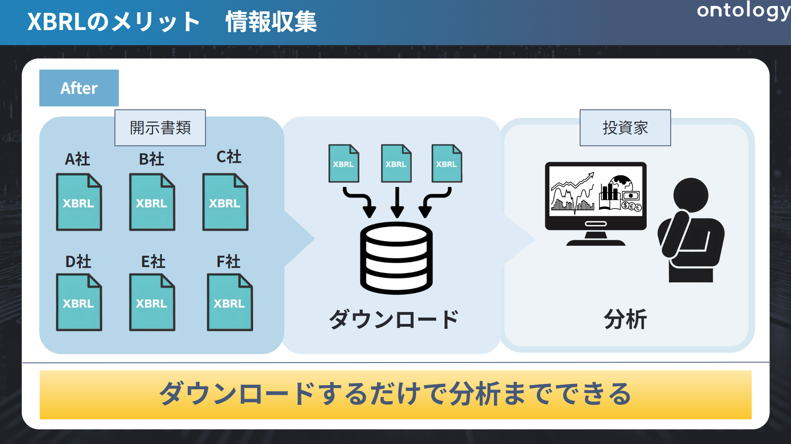

# XBRLの基礎知識

## 本章の目的

XBRLとは財務報告をするための情報を誰もがまとめやすく、拡散しやすく、利用しやすいように国際的に標準化された電子開示に適したコンピュータ言語です。
これらは国際規格であり、各国で投資家はXBRLを用いた意思決定を実施しております。しかし、世間にはXBRLの解説があまり存在しないことから、学習コストが高いのも事実です。
そこで、本章では、そもそもXBRLとはどういったものなのか、XBRLがあることで何が嬉しいのか、XBRLの注意点について解説をしていきます。

## XBRLとは

XBRLとは財務報告をするための情報を「誰もがまとめやすく、拡散しやすく、利用しやすい」ように国際的に標準化された電子開示に適したコンピュータ言語です。

XML [^1] というメタ言語をベース作られ、財務情報を記述に特化しています。

[^1]: 様々なデータを記述するために用いるマークアップ言語を開発するためのメタ言語。

名前は「eXtensible Business Reporting Language」の略で、「拡張可能な事業報告言語」を意味します。

同じ形式でデータ管理することでプログラムでたくさんの企業の情報を一気に取って来て財務分析を行えたり、毎回0から開示書類を作成しなくてよいといった恩恵があります。

作成者側のメリットは、作られたフォーマットに企業情報を項目として入力するだけで簡単に報告書を作成することができることです。
利用者側のメリットは、有報であればEDINETでワンクリックでダウンロードできることです。ダウンロードしたものは様々な形式に変換できることはとても使いやすいものです。

## XBRLの特徴

XBRLの特徴は、タクソノミとインスタンスの二つによって構成されていることです。

タクソノミとインスタンスを一言で表すと、タクソノミはひな型、インスタンスはその中身のデータです。

### タクソノミ

タクソノミとは、英語で「Taxonomy」で「分類」という意味し、情報・データなどの階層構造で整理したものを指します。
この要素はをタグと言い、このタグの構造と意味を定義するものこそがタクソノミといいます。そのため要素ひとつひとつに対して項目（名称）を定義し紐付けるものがタクソノミといえます。このタグを指定することで、ぱっと見の名称が異なっていても本質的な意味（タグ）が同じもの同士を比較したり、複数の企業からその情報を取得することが可能になります。

### インスタンス

インスタンスとは、英語で「Instance」で「実例」などを意味します。
XBRLにおけるインスタンスは、タクソノミで定義したひな型に対し、実際の情報・データそのものを指します。
以下の画像は、タクソノミとインスタンスが記載されているドキュメントの一例になります。

タグは<>記号で囲まれている箇所であり、、初めは「<>」、終わりは「</>」とスラッシュが入ります。
この間の要素こそがインスタンスになります。こちらはHTMLなどに触れたことがある方はイメージしやすいかと思います。

今回であれば、少し見づらいですが、書き始めが頭一つ引っ込んでいる `<us-gaap:Revenue … decimales=”0></us-gaap:Revenue> `がタグです。
そして、「200000」がインスタンス（実際の情報・データ）です。

インスタンスでは数値のデータはもちろん、テキストデータも存在しており、最近ではこのテキストデータを用いた分析等のニーズも増えています。

例えば公開されている研究だと,

> ”渡部 美紀子(2022年)「Covid-19パンデミックに関する有価証券報告書「事業等のリスク」の記載の変化」、『危険と管理』、53巻、pp.112-128.”

などがあり、「COVID-19が発生してから2021年３月まで２度の決算を迎えた３月決算企業の有価証券報告書「事業等のリスク」への記載内容の変化を通して、日本企業のCOVID-19に対する情報開示の変遷」（渡部 2022 p.112）についての考察を目的として、研究がされています。

これらの論文では例えば、『「事業等のリスク」や「ESG項目」などのテキストデータの変化に応じて「業績」や「株価」の数値にも影響が及ぼされているのではないかを確かめる』ような分析が行われています。

## XBRLのメリット

XBRLが出てくる前は、財務報告書類は企業ごとに紙媒体で作成されており、企業にとって非常に手間やコストのかかる作業となっていました。
さらには紙媒体で作成されている情報では二次利用 [^2]は困難でした。

[^2]: 情報のファイル形式を変え利用すること。例えば、ネットでの公開、研修用の教材、既存システムで使用されるがそれぞれ適した形式が異なる。

しかし、現在ではXBRLの登場によりこれらのデメリットは解消され、むしろそれらは以下のようなメリットになりました。

XBRLはタクソノミでタグを指定することにより、

- ひな型に項目（インスタンス）を入力するだけで書類を作成できる作成コストの大幅カット
- EDINETなどで簡単に様々な形式でダウンロードができる流通の良さ
- タグで情報を紐づけているためファイル形式を変換し二次利用がしやすい

といったことを実現させました。これらを大きく分けて3者の立場に立って詳しく説明します。

### 利用者へのメリット

利用者というのは投資家、アナリスト等、企業の状態を判断するために有価証券報告書等の書類を閲覧情報利用者を指します。かつては、利用者は開示された資料を見て、手動で再入力・転記することで情報を集めておりました。
これでは時間もかかるのにミスが生じやすく、確認作業の負担も大きくなってしまいます。このような状況ですと分析どころではありません。

[^3]

XBRLには整合性チェックの機能があるため、ミスやエラー防止され、情報の品質と透明性が向上しました。これにより、迅速に情報を加工・分析することが容易となりました。

[^3]

[^3]: 画像は「適時開示情報のXBRL化｜日本取引所グループ」を参考に筆者が作成しました。

### 作成者へのメリット

作成者とは、主に上場企業などXBRLを用いて書類を作成する人を指します。例えば、有価証券報告書をXBRLに手打ちして毎回作成するとなると（時間もお金も）作成コストが莫大にかかってしまいます。

開示書類は金融庁によるEDINETの稼働により、全面XBRL化されましたが、印刷会社のシステムにより作成者自身はXBRLを気にせずに作成することができます。

開示書類の作成支援システムとして、主に宝印刷のX-Smartや、プロネクサスのプロネクサスワークスの2種類があります。これらを使用することで、WordのようなUIを用いて数値や文章を入力するだけで、XBRLに対応した書類を作成できるようになりました。さらに、XBRLの特徴でもあるタグが暗黙的に記録されるため、わざわざ作成者側がタグ付けを意識することもなく、自動的にタグが付与されたXBRL形式でデータがEDINETに展開されることになります。なお、こうした印刷会社の努力により、開示書類を作っている方でもXBRLの存在を知らないケースも多いのが実情です。これにより、開示情報としての価値が格段に向上します。

### 提出機関へのメリット

提出機関とは、主に証券取引所や監督機関などを指します。提出機関は、作成された書類の整合性チェックなどをする必要がありました。XBRLは整合性チェックの機能があるため、一部の確認作業を自動化し、業務効率化を図ることができます。機械判別も合わせて実施することで、制度・信憑性の高い財務情報の取得にもつながります。

## XBRLの問題点

ここまでXBRLのメリットを紹介しました。ですが、デメリットも存在します。

主なデメリットは以下の3つです。

- 会計基準の違いがある場合は比較できない
- タグの付け方にすべてが依存される
- タクソノミを毎年チェックしなくてはならない

### 会計基準の違いがある場合は一括取得できない

大前提として、会計基準の違いがある場合は、同一の条件で一括で財務データを取得できません。
例えば、JGAAP（日本会計基準）とIFRS（国際会計基準）ではそもそもタグ自体が異なるものを利用されているため、同じ条件ではデータを抜き出すことが不可能になってます。例えば、売上高だけでもJGAAPとIFRSではタグが異なるため、JGAAP用とIFRS用に分けて取得条件を書く必要があります。

### タグの付け方にすべてが依存される

企業独自が設定しているタグに関しては共通化されていません。そのため、複数の企業の情報を取得する際には、タグによってはうまく取得することが出来ないケースがあります。
要因としては、XBRLファイルの作成自体を印刷会社のシステムに依存していることが一因になります。印刷会社のシステムを利用することで、利用者はタグの付け方を意識せずにXBRLファイルを作成できてますが、そのせいでタグが正確につけられないことがあります。
例えば、昨今、注目されているESGの活動についても2023年までは政府が指定しているタクソノミがなかったため、会社独自の拡張タクソノミを指定していました。その結果、当時は複数の企業が一括で取得することが困難でした。

### タクソノミを毎年チェックしなくてはならない

タクソノミは毎年変わるものであるため、毎年チェックする必要があります。ESGのタグのようにほとんどの企業が開示情報に記述する内容であれば、更新され標準タクソノミになることもありますが、今後開示項目が追加削除されるにつれて、タクソノミが変更されるリスクがあります

## まとめ

XBRLは財務報告をするための情報を誰もがまとめやすく、拡散しやすく、利用しやすいように標準化されたコンピュータ言語です。統一されたタクソノミのおかげで、財務情報に関わる利用者、作成者、提出機関のすべてにおいて利便性の向上が見込めます。

次の章では、XBRLの一番の特長であるタクソノミとインスタンスをより詳しく解説します。
