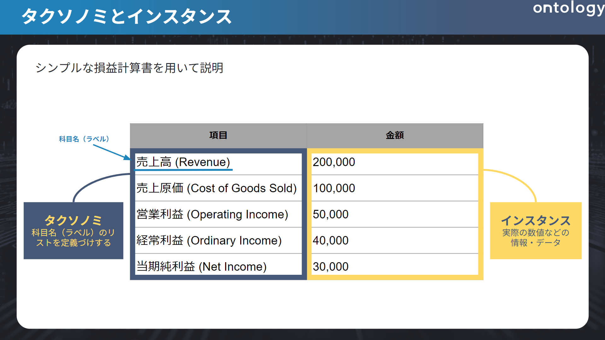
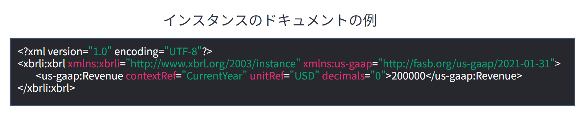
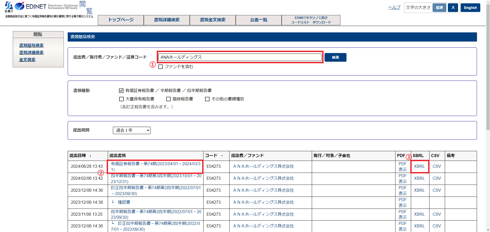
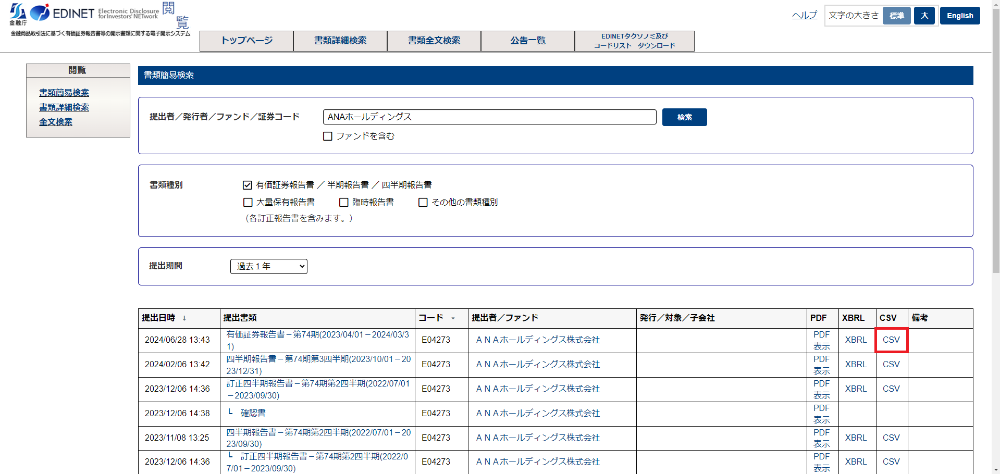
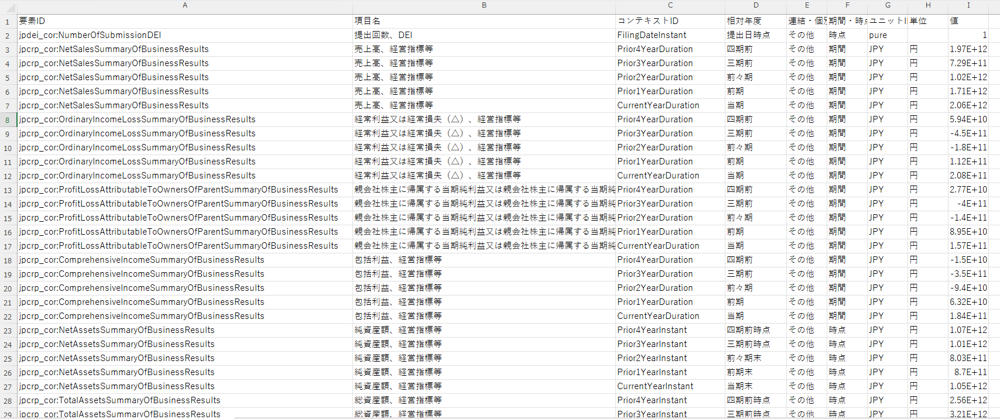
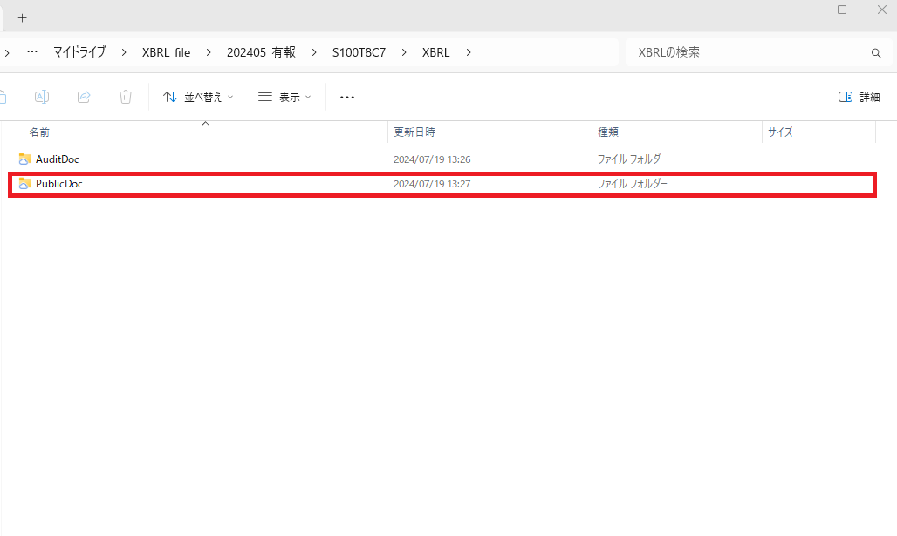
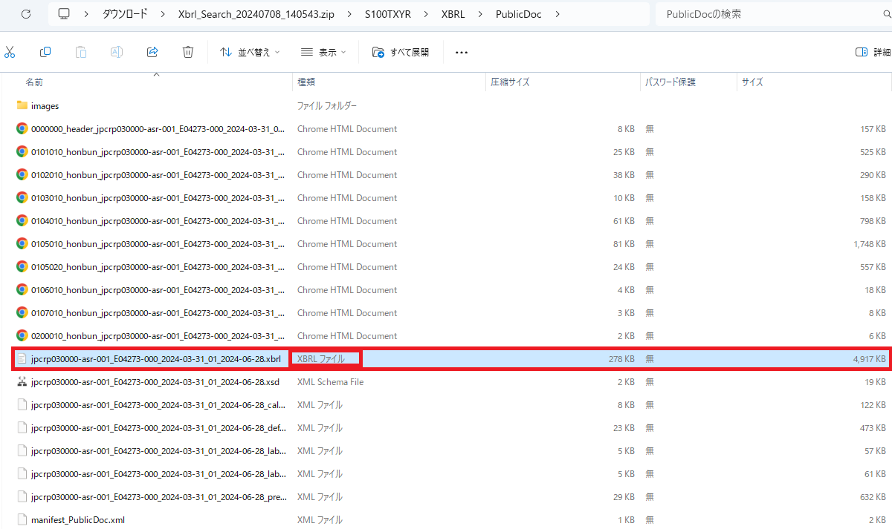
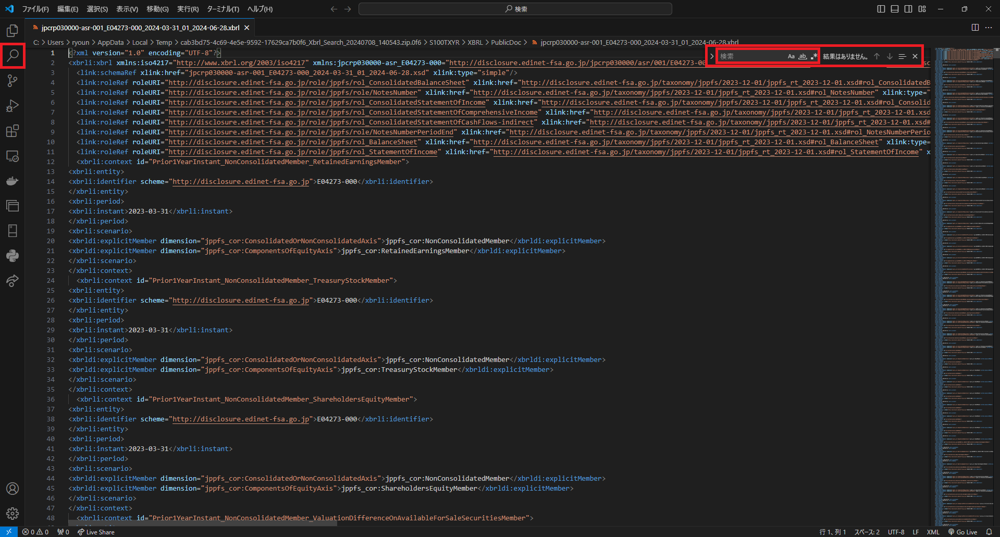
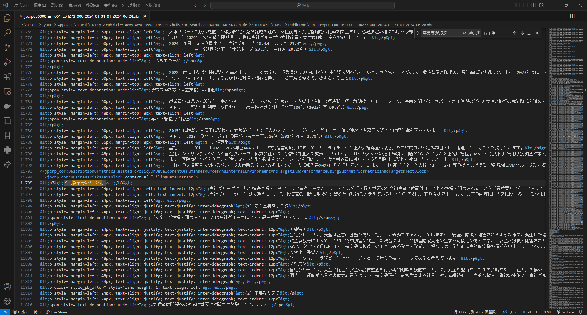

# 本章の目的
XBRLのメリットとしてたくさんのデータから任意のものだけを自動で取得することができるというものがあります。

これを行うためにはXBRLの特徴をつかんでなくてはなりません。前章でも少し触れましたが、それが「タクソノミ」と「インスタンス」になります。

また、情報元である有価証券報告書について知ることで任意のデータを取得できるようになりましょう。

# タクソノミとインスタンス

XBRLは大きく分けて**タクソノミ**と**インスタンス**という二つによって構成されています。

それぞれを一言で表すと、 **タクソノミはひな型**、**インスタンスは中身**といったイメージです。

（１）タクソノミ

タクソノミとは、情報・データなどの階層構造で整理したものを指します。

この要素はを**タグ**と言い、このタグの構造と意味を定義するものこそがタクソノミといいます。

そのため要素ひとつひとつに対して項目（名称）を定義し、紐付けるものがタクソノミというわけです。

このタグを指定することで、ぱっと見の名称が異なっていても本質的な意味（タグ）が同じもの同士を比較したり、複数の企業からその情報を引っ張って来ることができるのです。

タクソノミの構造として政府が取り決めた**標準タクソノミ**とその企業独自のタクソノミである**提出者別タクソノミ**の組み合わせで出来ています。

標準タクソノミは政府によって作られているためタクソノミとして統一され、プログラムを組んで情報を取る際には指定されていれば一気に取ることができます。一方、提出者別タクソノミはその名の通り、個別で指定しているものなので他の企業でそのタクソノミで設定されているケースがほとんどなく個別対応をしなければならないというのが特徴となります。

（２）インスタンス

XBRLにおけるインスタンスは、タクソノミで定義したひな型に対し、**実際の情報・データそのもの**を指します。
以下の画像を参照して実際にどうインスタンスが入っているかのイメージしていきましょう。

タグは<>記号であらわされます。

二つ一組になっており、初めは「<~>」、終わりは「</~>」とスラッシュが入ります。

この間の要素こそが中身の情報を表しています。

今回であれば、書き始めが頭一つ引っ込んでいる <us-gaap:Revenue … decimales=”0></us-gaap:Revenue> がタグです。

そして、「200000」がインスタンス（実際の情報・データ）というわけです。

すごく単純に言えば、「**インスタンス＝タクソノミの中身**」と思っていただければ大丈夫です。

（３）タクソノミとインスタンスの欠点

どの技術にもメリットがあればデメリットがあるようにXBRLにも欠点があります。

この欠点とはXBRLを利用していく中で避けては通れません。

むしろXBRL活用はこれらの欠点と向き合うことに他ならないと私は考えます。

XBRLを活用するならば以下のことについてはさっさと諦めて腹をくくりましょう。

タクソノミとインスタンスの欠点は以下の3つに集約されます

- 文章の細かい段落ごとでは抜き出せない
- そもそもタクソノミが指定されていないこともある
- 抜き出す内容を理解しないと抜け出せない

一つずつ見ていきましょう。

a.文章の細かい段落ごとでは抜き出せない

文章などのテキストデータもタクソノミの中身であるインスタンスにすぎません。

インスタンスはあくまで、タクソノミで指定された”ハコ”の中身です。

このハコごと取って来ることはできても、 ハコの中身の一部分だけ取って来ることはできません。
つまり、**抜き出せる情報の最小単位は「タクソノミで区切られたもの」**ということです。

このタクソノミで分割されていない文章の細かい段落をそれぞれ分割して抜き出すことはできないのです。

例えば有報の目次では、形が同じであってもタクソノミは大項目についていて小項目もすべて一つのインスタンスとして格納されているため欲しい情報以外の情報も取れてしまうといったことがあります。このような場合、情報を取り出した後本当に欲しい情報のところだけを切り抜く作業をしなくてはなりません。これがXBRLを扱う上で一番つらいところになるでしょう。

もしいらない部分などがある場合には、抜き出した後に利用したい形に合わせてデータ加工をする必要があります。世の中のXBRLユーザーは日々こちらと向き合っているので、とても根気が必要なのです。

b.タクソノミが指定されていない

タクソノミは指定されているが思い通りにいかないという欠点について話しましたが、もっと根本的な問題がある場合もあります。それは、**そもそもタクソノミが指定されていないことがあることです**。ただし、思い通りに情報を抜き出せないケースよりは少ないです。ごくまれにこのようなケースもあるといった程度です。

欲しい情報のところにタクソノミが指定されていないとそもそもXBRLを用いて情報を抜き出すことすらできず、そのままコピペするということも起こります。これではせっかく標準タクソノミなどで準備がされていても全く意味がありません。

例えば、2023年度まではESG*² に関する標準タクソノミが準備されておらず、提出者別タクソノミを設定していました。そういった状況の中ではタクソノミが設定されず抜け落ちてしまうケースも実際にありました。

また、勘定科目においても同様で、タクソノミに記載されていないような特殊な勘定科目にはタグがついていないことがあります。

タクソノミが指定されていない状況になる原因はいくつか考えられます。有報を作成している人がタクソノミの重要性を知らないというケースや使用しているシステムが様々な企業に対応できるよう自由度が高く設計されているが故の弊害としてタクソノミが指定されていなくても資料としてOKが出てしまうケースなどです。

しかし、これらはあくまで推測でしかなく、詳しい理由などはわからないのが現状です。有報の作成者やシステムを作っている方たちにはこのようなことが起こり得るということを十分に理解してもらい、起こらないようにしてほしいですね。

---

*2　ESGとは、 Environment(環境)、 Social(社会)、 Governance(ガバナンス（企業統治）)を考慮した投資活動や経営・事業活動のこと。

引用：内閣府ホームページ　2.2　ESGの概要

[2.2.1 ＥＳＧとは何か｜令和２年度障害者差別の解消の推進に関する国内外の取組状況調査報告書 - 内閣府](https://www8.cao.go.jp/shougai/suishin/tyosa/r02kokusai/h2_02_01.html#:~:text=ＥＳＧとは、Environment（環境,経営・事業活動を指す。)

c.抜き出す内容がわかってないといけない

今度は全く別の角度からの欠点です。

情報の取捨選択ができる知見を持たないと上記2つの欠点にも気づくことすらできません。

いくらタクソノミがきれいに指定してあっても情報を取ってくる人がXBRLの知識だけ持っていて取って来る情報そのものについて知らなければ情報を取って来ることはできません。

つまり、知りたい情報がどこに書いてあるのかわかってないとどんなタクソノミを指定すればいいのかなんてわかるはずもないということです。

そういった意味で取って来る情報の対象である有価証券報告書等に関するドメイン知識は必須と言えるでしょう。
また、有報だけ知っていても、タクソノミとインスタンスという概念やタクソノミの参照方法も知らずには情報は取れません。

公認会計士などは有価証券報告書を読むことに慣れているかもしれませんが、タクソノミとの紐づけが出来ていない人が多いと推測されます。タクソノミのことを勘定科目マスタと考えている人も実は多いです。

どちらの知識も正確に身に着けることが大事なのです。

そういったわけで、次の章からは調べる対象を有報に絞って、有報についてとタクソノミの参照方法について説明しようと思います。

# 有価証券報告書とは

有価証券報告書とは、事業年度ごとに企業自ら売上などの財務情報や経営状況を外部に開示するための資料です。おもに最新の情報は決算短信などで外部に報告し、事業年度が切り替わってから前年度分の総まとめとして提出されるものです。

基本的に事業内容が変われば、有報の書かれる内容も変わるため、構造自体が変わるということもあります。

有報を作成する際に目次は決まっていますが、その中の項目は各企業で変わってくるためこの中から知りたい情報を探すということになってきます。

有報を作成する多くは、印刷会社（宝印刷、プロネクサス）のシステムを用いたうえで、ASBJ *³ や印刷会社が出している記載要領を等を参照してつくります。そのため、原則的に記載内容が似ているケースが多いですが、細かいところの書きぶりは変わってきます。

例えば、事業等のリスクの項目は、企業ごとに書き方が変わりやすいところでしょう。

有報の構造は先ほども述べた通り、基本的に事業に左右される節があるため、同じ業界どころか同じ企業でも事業年度によっては構造が変わることがあります。

そのため、原則的には**目次を見る**ということを意識してもらいたいです。目次は基本的に記載ルールが決まっているため、大きくズレることはありません。

目次を見て知りたい情報が大体どこに何が書いてあるかというのが確認して、タクソノミとどう紐づいているのかを理解することがXBRL解析には大切です。

---

*3　正式名称は企業会計基準委員会。日本の会計基準などを作る機関。

(1) 有報の見方

有報はEDINET（エディネット）で誰でも無料で閲覧することが可能です。

書類簡易検索の中の「書類種別」の有価証券報告書にチェックマークを入れ、
「提出者／発行者／ファンド／証券コード」の検索窓で任意の企業の名前を入れるだけで検索できます。

提出期間はデフォルトで1年となっていますが、全期間(有報であれば10年）に伸ばすこともできます。

(2) よく見られる項目

財務情報であれば、「経理の状況」のところに財務諸表等が掲載されてあるためこの辺を参照するといいでしょう。

また、有報が決算短信よりも優れている点として、**テキストデータが豊富**ということが挙げられます。テキストデータとはいわゆる文章での情報です。

テキストデータに注目が集まる理由としては、数値だけでは説明しきれない状況や背景などについて説明できるという点が挙げられます。

テキストデータからはこれまでの数値これから表れてくるであろう「良いこと・悪いこと」について説明できます。

その点で決算短信などと比べたときにより多くの情報を得られると考える人も少なくありません。人はこの文章で情報を読み取ることができますが、プログラムなどで動く機械にとってはこの文章での情報は何の役にも立たないものでした。

しかし、ChatGPTをはじめとする自然言語処置という技術の発達によりこのテキストデータからも機械が分析できるようになってきているのです。そういった背景からテキストデータに注目が集まっています。

テキストデータから情報を取ってくるには、「事業の状況」に経営方針や事業等のリスクがあるため、懸念点の洗い出しなどが見込めます。そのほかにも昨今注目されているESG やコーポレート・ガバナンスなどについての情報はよく見られる点だと思います。

これらは同じ業界・同じ規模感の企業であっても、企業の特色が出やすく比較がしやすいため投資家などからよく見られる印象があります。

数値だけでも区別することはできますが、なぜその数値なのかという背景までわかるとより分析に深みが出ると思います。この背景を知る項目として文章で構成される「経理の状況」や「事業等のリスク」などはよく見られると思います。

# データを取得するために

(1) 知りたい情報から逆算

上記までで何についての情報が欲しいかという目処が立ったら、次はその情報のタクソノミを調べましょう。実際に欲しい情報はタクソノミの中のインスタンスですが、そのインスタンスを取るためにはタクソノミが必要というわけです。

タクソノミの章の復習となりますが、タクソノミは政府が取り決めた標準タクソノミとその企業独自のタクソノミである提出者別タクソノミの組み合わせで出来ています。

知りたい情報がわかったらまずその知りたい情報が標準タクソノミなのか提出者別タクソノミなのか知る必要があります。

標準タクソノミであれば基本的に他の企業でも芋づる式に取って来れます。

ただし提出者別タクソノミであった場合、一つ一つ取って来ることを覚悟してください。

例えば、特別損失の勘定科目などはタクソノミで取れないケースが多いでしょう。 

提出者別タクソノミであっても場合によっては同じタクソノミを設定していることもあります。その際はラッキーくらいに思っておくといいでしょう。あまり期待しすぎると違った時つらいので…。

## XBRLフォルダの用意

実際に有報からどのようにしてほしいインスタンスのタクソノミを見つけるのか実践してみましょう。

EDINETにアクセスをして、任意の上場企業を調べ有報をダウンロードします。

今回は例として「ANAホールディングス」を用います。

まずは、以下のリンクからEDINETへ飛んでください。

▼EDINET

https://disclosure2.edinet-fsa.go.jp/week0010.aspx

そしてサイト内の検索窓から「ANAホールディングス」と検索し、提出書類が「有価証券報告書」となっているものを探します。四半期報告書などがたくさんありますので気を付けてください。

見つけたら右の「XBRL」をクリックしてください。

これでXBRLフォルダがダウンロードされます。

Windowsの方はエクスプローラー、Macの方はFinderにXBRLフォルダがダウンロードできているか確認してください。

他にもAPIを使用してXBRLフォルダをダウンロードする方法もあるのですが、今回は少数のダウンロードのため、EDINETからダウンロードする方が簡単なので今回は割愛します。

たくさんの情報から分析をしたいなど、大量の有報をダウンロードすることについては次の記事で取り扱います。

# タクソノミの参照方法

次は**欲しいインスタンスが入っているタクソノミはどうやって調べればいいのか**です。

2024年7月現在では、大きく分けて3種類タクソノミの参照方法があります。

- EDINETからCSVファイルをダウンロードして検索
- XBRLファイル内での検索
- 金融庁のタクソノミ要素リストを参照する

という3つです。

本章では以上の3つの参照方法の概要だけ説明します。この3つの参照方法は一長一短ですのでここで説明する概要と5章以降でデータを取得する際に実践例を見てどう使い分けるものなのか理解していただけると良いと思います。
また、具体的な参照方法については各章の「タクソノミを確認しよう」を見ていただければより詳細にわかると思います。

## EDINETからCSVファイルをダウンロードして検索

まずはEDINETから任意の有報をダウンロードする画面で、「CSV」をダウンロードしましょう。

その中から圧縮サイズが一番大きいファイルを開き以下のような表を参照できる状態にしてください。

ざっくりとこの表の見方を言うと、

- 「要素ID」＝ タグ
- 「項目名」＝ 勘定科目や目次など
- 「コンテキストID」＝ 期間を示すもの
- 「相対年度」＝コンテキストIDに対応する期間
- 「連結・個別」＝連結の情報か単体の情報か

その他はカラム通りの意味です。特に大事になって来るのが以上の5つです。

項目名と相対年度に対応する要素IDとコンテキストIDが何かを知ることこそが必要になってきます。連結・個別に関しては、これによってコンテキストIDが異なるので注意しましょう。

## XBRLファイル内での検索

データは引き続きANAの有報を用いて説明します。

1. ダウンロードしたzipファイルを解凍し、開いていく
2. 有報の**XBRLフォルダ**を開く
3. XBRLフォルダの中のPublicDocを開く
    
    
    
4. **XBRLファイル**を探す
（種類のカラムを参照するとわかりやすいです）
    
    ※ややこしいので注意
    
    
    
5. テキストエディターで開く（例：VSCode）
    
    ※Wordはダメ（検索できなかったり、どれがタクソノミかわからなかったりする）
    　メモや検索エンジンではダメではないが色がついていない分見づらく感じた。
    
6. 「Ctrl(Command) + F」で任意の情報を検索（サイドバーの虫眼鏡マークでも検索可）

    
    
    例えば「事業等のリスク」などで検索し、タクソノミを見てみましょう。
    
    

このような感じで調べたいインスタンスから逆算的にタクソノミを探すことができます。

今回の「事業等のリスク」のタクソノミですと、jpcrp_cor:BusinessRisksTextBlock contextRef="FilingDateInstant”*⁴ ****が該当します。

---

*4　後半の「contextRef="FilingDateInstant”」は ”当期” の意味。

## 金融庁のタクソノミ要素リストを参照する

まずはこの手法のメリットとして政府が出しているタクソノミの要素に関しては網羅しているということです。ただし、デメリットとしてかなりの量があるため慣れていないと何が何だかよくわからない（わかりづらい）、ファイルであるため更新されても同じものを使っていれば気付きづらいというものが挙げられます。よって他の2つと使い分けて参照することをオススメします。

では、以下のファイルをダウンロードしてはじめて行きましょう。

▼金融庁　タクソノミ要素リスト

[1e_ElementList.xlsx](https://prod-files-secure.s3.us-west-2.amazonaws.com/8462a5f5-2269-4832-abed-8bac1cfbc489/08e36eb0-db99-455a-974f-794aa1a2c792/1e_ElementList.xlsx)

有価証券報告書以外の書類についての情報も載っているため、まずは有報の情報にたどり着くための手順について説明します。

ファイルをダウンロードし開いてみると以下のような目次のシートに行くと思います。

▼目次の画面

目次から「9 企業内容等の開示に関する内閣府令 第三号様式 有価証券報告書（jpcrp03000-asr)」のシートを選択し、「Ctrl」＋「F」で検索窓から知りたい項目について検索し、「詳細ツリー‐標準ラベル（日本語）」（B列）でヒットするものを探しましょう。

「冗長ラベル（日本語）」（C列）で連結のものと個別のものが分かれていることが確認できるため連結のものの「名前空間プレフィックス」（H列）と「要素名」（I列）を参照してタグとして使用します。

このようにして、タクソノミを参照することができます。

---

この3種類以外にも自力で探す方法やXMLファイルからダウンロードするなど方法がないわけではありません。しかし、XBRLファイルでは数万行あることもあるので、自力は厳しく、XMLファイルを探す方法はまったくお勧めできません。

個人的には、慣れないうち1つ目と2つ目を使い分けるのがいいと思います。財務データを取得したい場合には１つ目。非財務データを取得したい場合には２つ目を利用するのがやりやすいと思います。

理由として、１つ目のやり方では、財務・非財務どちらの情報に対しても取得はできますが、CSVの内容が必ずしも合っている保証がなく、まれに間違っている場合もあるという大きな欠陥があるためです。また、２つ目の方法では、財務情報を取得したい場合に勘定科目を検索してもインスタンスと別の場所に格納されてしまっているため、勘定科目から逆算的にタグを知ることができないためです。

逆にどれがタグでどれがcontext_refでこのタグはだいたいこんな意味だななどが理解できて来たら3つ目の情報量にも惑わされないと思います。

このように一長一短ではあるので場合に分けてデータを取得する方法を選ぶべきだと思います。

# まとめ

本稿では、元情報である有報のXBRLフォルダをダウンロードし、インスタンスを抜き出すためにタクソノミの参照方法やその注意点などについて幅広く扱いました。

あくまで大事なことはどのような流れで情報を取って来れるのかという流れや概念の理解をしていただければ幸いです。

今回まででXBRLはどういったもので、どんな感じのことをすれば情報を抜き出すことができるという頭の中でなんとなくわかるという状態ができたと思います。

次の章では、データを分析するための大量のデータを収集してみます。
1カ月単位の大量の有報を自動で取得できるようになりましょう。

# 参考
▼一般社団法人　XBRL JAPAN -XBRLとは

[一般社団法人 XBRL Japan - XBRL Japan Inc. - XBRLとは](https://www.xbrl.or.jp/modules/pico1/index.php?content_id=9)

▼日本取引所グループ　適時開示情報のXBRL化　最終更新2021/10/25

[適時開示情報のXBRL化 | 日本取引所グループ](https://www.jpx.co.jp/equities/listing/disclosure/xbrl/02.html)

▼金融庁　2024年版EDINETタクソノミの公表について　公表2023/12/11

[2024年版EDINETタクソノミの公表について](https://www.fsa.go.jp/search/20231211.html)

▼内閣府ホームページ　2.2　ESGの概要　

[2.2.1 ＥＳＧとは何か｜令和２年度障害者差別の解消の推進に関する国内外の取組状況調査報告書 - 内閣府](https://www8.cao.go.jp/shougai/suishin/tyosa/r02kokusai/h2_02_01.html#:~:text=ＥＳＧとは、Environment（環境,経営・事業活動を指す。)