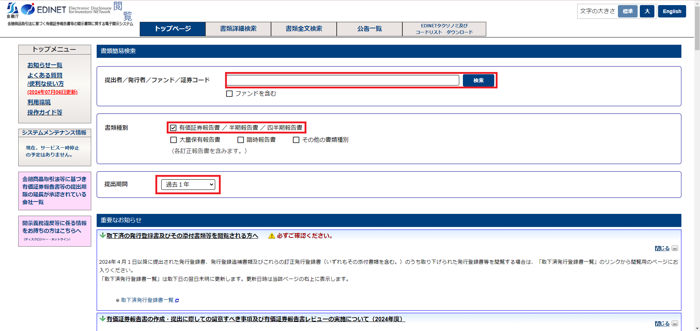

# タクソノミと有報

## 本章の目的

XBRLのメリットとして、たくさんのデータから任意のものを自動で取得できることがあります。これを行うためにはXBRLの特徴を理解する必要があります。本章では、前章でも少し触れたXBRLの一番の特徴である「タクソノミ」と「インスタンス」について欠点を交え、解説します。

また、情報元である有価証券報告書について知ることで、任意のデータを取得できるようになりましょう。

## タクソノミとインスタンス

### タクソノミ

タクソノミとは、情報・データなどの階層構造で整理したものを指します。この要素をタグと言います。このタグの構造と意味を定義するものこそがタクソノミといいます。要素ひとつひとつに対して項目（名称）を定義し、紐付けるものがタクソノミというわけです。

タクソノミには、政府が取り決めた「標準タクソノミ」とその企業独自のタクソノミである「提出者別タクソノミ」の2種類があります。標準タクソノミは政府によって統一されています。一方、提出者別タクソノミは企業が独自に指定しているものであり、他の企業でそのタクソノミで設定されているケースはほぼ無いため、個別対応をしなければなりません。

### インスタンス

XBRLにおけるインスタンスは、実際の情報・データそのものを指します。単純に言えば、インスタンス＝タクソノミの中身です。

### タクソノミとインスタンスの欠点

どの技術にもメリットがあればデメリットがあるようにXBRLにも欠点があります。この欠点とはXBRLを利用していく中で避けては通れません。むしろXBRL活用はこれらの欠点と向き合うことに他ならないと私は考えます。

タクソノミとインスタンスの欠点は以下の3つに集約されます。

- 文章の細かい段落ごとでは抜き出せない
- そもそもタクソノミが指定されていないこともある
- 抜き出す内容を理解しないと抜け出せない

一つずつ見ていきましょう。

#### 文章の細かい段落ごとでは抜き出せない

文章などのテキストデータもタクソノミの中身であるインスタンスにすぎません。インスタンスはあくまで、タクソノミで指定されたハコの中身です。このハコごと取って来ることはできても、ハコの中身の一部分だけ取って来ることはできません。つまり、抜き出せる情報の最小単位は「タクソノミで区切られたもの」ということです。このタクソノミで分割されていない文章の細かい段落をそれぞれ分割して抜き出すことはできないのです。

例えば有報の目次では、形が同じであってもタクソノミは大項目についていて小項目もすべて一つのインスタンスとして格納されているため、欲しい情報以外の情報も取れてしまう場合があります。このような場合、情報を取り出した後に、本当に欲しい情報のところだけを切り抜く作業をしなくてはなりません。これがXBRLを扱う上でつらい箇所になるでしょう。もしいらない部分などがある場合には、抜き出した後に利用したい形に合わせてデータ加工をする必要があります。世の中のXBRLユーザーは日々このような泥臭い作業に向き合っているのです。

#### タクソノミが指定されていない

タクソノミは指定されているが思い通りにいかないという欠点について話しましたが、もっと根本的な問題がある場合もあります。それは、そもそもタクソノミが指定されていないことがあることです。

ごくまれにこのようなケースもあるといった程度ですが、実際に存在します。欲しい情報のところにタクソノミが指定されていないとそもそもXBRLを用いて情報を抜き出すことすらできません。これではせっかく標準タクソノミなどで準備がされていても全く意味がありません。

例えば、2023年度まではESG [^1]に関する標準タクソノミが準備されておらず、提出者別タクソノミを設定していました。そういった状況の中ではタクソノミが設定されず抜け落ちてしまうケースも実際にありました。また、勘定科目においても同様で、タクソノミに記載されていないような特殊な勘定科目にはタグがついていないことがあります。

[^1]: ESGとは、Environment(環境)、Social(社会)、Governance(ガバナンス（企業統治）)を考慮した投資活動や経営・事業活動のこと。引用：内閣府ホームページ2.2_ESGの概要

#### 抜き出す内容がわかってないといけない

今度は全く別の角度からの欠点です。情報の取捨選択ができる知見を持たないと上記2つの欠点にも気づくことすらできないという点です。いくらタクソノミがきれいに指定してあっても情報を取ってくる人が取って来る情報そのものについて知らなければ意味がありません。取って来る情報の対象である有価証券報告書等に関するドメイン知識は必須と言えるでしょう。
また、有報だけ知っていてもタクソノミとインスタンスという概念やタクソノミの参照方法も知らずには情報は取れません。公認会計士などは有価証券報告書を読むことに慣れているかもしれませんが、タクソノミとの紐づけが出来ていない人が多いと推測されます。タクソノミのことを勘定科目マスタと考えている人も実は多いです。どちらの知識も正確に身に着けることが大事なのです。

そういったわけで、次の章からは調べる対象を有報に絞って、有報についてとタクソノミの参照方法について説明しようと思います。

## 有価証券報告書とは

有価証券報告書とは、事業年度ごとに企業自ら財務情報や経営状況を外部に開示するための資料です。主に事業年度が切り替わってから前年度分の総まとめとして提出されるものです。基本的に事業内容が変われば、有報の書かれる内容も変わるため、構造自体が変わるということもあります。有報を作成する際に目次は決まっていますが、その中の項目は各企業で変わってくるためこの中から知りたい情報を探すということになってきます。有報を作成する多くは、印刷会社（宝印刷、プロネクサス）のシステムを用いたうえで、ASBJ[^2] や印刷会社が出している記載要領を等を参照して作ります。そのため、原則的に記載内容が似ているケースが多いですが、細かいところの書きぶりは変わってきます。

例えば、事業等のリスクの項目は、企業ごとに書き方が変わりやすいところでしょう。有報の構造は先ほども述べた通り、基本的に事業に左右される節があるため、同じ業界どころか同じ企業でも事業年度によっては構造が変わることがあります。

原則的には目次を見ましょう。目次は基本的に記載ルールが決まっているため、大きくズレることはありません。目次を見て知りたい情報が大体どこに何が書いてあるかというのが確認して、タクソノミとどう紐づいているのかを理解することがXBRL解析には大切です。

[^2]: 正式名称は企業会計基準委員会。日本の会計基準などを作る機関。

### 有報の見方

有報はEDINET（エディネット）で誰でも無料で閲覧することが可能です。書類簡易検索の中の「書類種別」の有価証券報告書にチェックマークを入れ、「提出者／発行者／ファンド／証券コード」の検索窓で任意の企業の名前を入れ検索することで閲覧できます。提出期間はデフォルトで1年となっていますが、全期間(有報であれば10年）に伸ばすこともできます。

### よく見られる項目

財務情報であれば、「経理の状況」に財務諸表等が記載されています。有報の特徴として、テキストデータが豊富ということが挙げられます。テキストデータとはいわゆる文章での情報です。テキストデータに注目が集まる理由としては、数値だけでは説明しきれない状況や背景などについて説明できるという点が挙げられます。人はこの文章の情報を読み取ることができますが、機械にとってはこの文章の意味はわかりませんでした。しかし、自然言語処理技術の発達により、このテキストデータを
用いた分析を機械ができるようになってきており、テキストデータにより注目が集まっています。

そのほかにも昨今注目されているESG やコーポレート・ガバナンスなどについての情報はよく見られる点です。これらは同じ業界・同じ規模感の企業であっても、企業の特色が出やすく比較がしやすいため投資家などからよく見られる印象があります。数値だけでも区別することはできますが、なぜその数値なのかという背景までわかるとより分析に深みが出ると思います。この背景を知る項目として文章で構成される「経理の状況」や「事業等のリスク」などはよく見られる。

## データを取得するために

上記までで何についての情報が欲しいかという目処が立ったら、次はその情報のタクソノミを調べましょう。実際に欲しい情報はタクソノミの中のインスタンスですが、そのインスタンスを取るためにはタクソノミが必要です。知りたい情報から逆算しましょう。

知りたい情報を決め、標準タクソノミなのか提出者別タクソノミなのかを確認しましょう。標準タクソノミであれば基本的に他の企業でも芋づる式に取って来れます。提出者別タクソノミであれば、一つ一つ取って来ることになります。

例えば、特別損失の勘定科目などはタクソノミで取れないケースが多いでしょう。
なぜならば特別損失に記載されている勘定科目は、企業特有のものが設定されている場合があるためです。例として「プロ野球選手移籍金」などは標準タクソノミに存在しないため、提出者別タクソノミによって追加され掲載されたことがあります。
提出者別タクソノミでは企業ごとに独自のタクソノミが追加されているため、基本的に同じ勘定科目だったとしても同じタクソノミが設定されていません。

## XBRLフォルダの用意

実際に有報からどのようにしてほしいインスタンスのタクソノミを見つけるのか実践してみましょう。EDINETにアクセスをして、任意の上場企業を調べ有報をダウンロードします。今回は例として「ANAホールディングス」を用います。まずは、以下のリンクからEDINETへ飛んでください。

▼EDINET

https://disclosure2.edinet-fsa.go.jp/week0010.aspx

そしてサイト内の検索窓から「ANAホールディングス」と検索し、提出書類が「有価証券報告書」を探します。「XBRL」をクリックしダウンロードします。

Windowsの方はエクスプローラー、Macの方はFinderにXBRLフォルダがダウンロードできているか確認してください。今回は手動で少数のダウンロードを行います。たくさんの情報を元に分析をしたいなど、大量の有報のダウンロードについては次章で取り扱います。

## タクソノミの参照方法

次に任意のタクソノミの参照方法について解説をします。

2024年7月現在、タクソノミの参照するなら以下の3つの方法がわかりやすいです。

- EDINETからCSVファイルをダウンロードして検索
- XBRLファイル内での検索
- 金融庁のタクソノミ要素リストを参照する

本章では以上の3つの参照方法の概要を説明します。

### EDINETからCSVファイルをダウンロードして検索

まずはEDINETから任意の有報をダウンロードする画面で、「CSV」をダウンロードしましょう。

その中から圧縮サイズが一番大きいファイルを開き以下のような表を参照できる状態にしてください。

この表は、その有報を構成しているすべてのタクソノミの情報をまとめた表です。特に以下の5つについて注目します。

- 「要素ID」＝ タグ
- 「項目名」＝ 勘定科目や目次など
- 「コンテキストID」＝ 期間を示すもの
- 「相対年度」＝コンテキストIDに対応する期間
- 「連結・個別」＝連結の情報か単体の情報か

コードを用いてデータ取得を行う際、直接必要となって来るのは要素IDとコンテキストIDの2つです。しかし、人間がそのままその2つを識別するのは難しいため、他の3つを加味し、任意のデータに当てはまる要素IDとコンテキストIDを調べます。

### XBRLファイル内での検索

データは引き続きANAの有報を用いて説明します。

1.  ダウンロードしたzipファイルを解凍し、開いていく
2.  有報のXBRLフォルダを開く
3.  XBRLフォルダの中のPublicDocを開く

    

4.  XBRLファイルを探す
    （種類のカラムを参照するとわかりやすいです）※ややこしいので注意

    

5.  テキストエディターで開く（例：VSCode）

    ※Wordはダメ（検索できなかったり、どれがタクソノミかわからなかったりする）
    　メモや検索エンジンではダメではないが色がついていない分見づらく感じた。

6.  「Ctrl(Command) + F」で任意の情報を検索（サイドバーの虫眼鏡マークでも検索可）

    

    例えば「事業等のリスク」などで検索し、タクソノミを探します。

    

このような感じで調べたいインスタンスから逆算的にタクソノミを参照することができます。

今回の「事業等のリスク」のタクソノミですと、

jpcrp_cor:BusinessRisksTextBlock

contextRef="FilingDateInstant”[^3]

が該当します。

[^3]: 「contextRef="FilingDateInstant”」は当期の意味。

### 金融庁のタクソノミ要素リストを参照する

この手法のメリットは政府が出しているタクソノミの要素に関しては網羅しているということです。ただし、デメリットとして情報量が多いため、慣れていない参照しづらいこと、提出者別タクソノミについては記載されていないなどが挙げられます。また絶対に正しいというわけでもなく間違いがあることもあります。よって他の2つと使い分けて参照することをオススメします。

では、以下のファイルをダウンロードして実際にタクソノミを調べてみます。

▼金融庁　タクソノミ要素リスト

[1e_ElementList.xlsx](https://prod-files-secure.s3.us-west-2.amazonaws.com/8462a5f5-2269-4832-abed-8bac1cfbc489/08e36eb0-db99-455a-974f-794aa1a2c792/1e_ElementList.xlsx)

有価証券報告書以外の書類についての情報も載っているため、まずは有報の情報にたどり着くための手順について説明します。

ファイルをダウンロードし開くと、以下のような目次のシートが表示されます。

目次から「9 企業内容等の開示に関する内閣府令 第三号様式 有価証券報告書（jpcrp03000-asr)」のシートに移ります。
「詳細ツリー‐標準ラベル（日本語）」（B列）を対象に知りたい項目を検索します。

「冗長ラベル（日本語）」（C列）で連結と個別を確認するため、連結の「名前空間プレフィックス」（H列）と「要素名」（I列）を参照します。これをタクソノミとして仕様します。

筆者としては、慣れないうちEDINETからCSVファイルをダウンロードして検索する方法と、XBRLファイル内での検索を使い分けるのを推奨します。財務データを取得したい場合には前者。非財務データを取得したい場合には後者を利用するのがやりやすいと思います。

なぜなら、前者では、財務・非財務どちらの情報に対しても取得はできますが、CSVの内容が必ずしも合っている保証がなく、まれに間違っている場合もあるという大きな欠陥があるため、後者では、財務情報を取得したい場合に勘定科目を検索してもインスタンスと別の場所に格納されてていることから勘定科目から逆算的にタグを知ることができないためです。
逆に、どれがタグで、どれがcontext_refで、このタグの意味はこうと理解出来るようになったら、XBRLフォルダの中のPublicDocを開く方法の情報量にも惑わされないと思います。このように一長一短ではあるので場合に分けてデータを取得する方法を選ぶのを推奨です。

## まとめ

本稿では、元情報である有報のXBRLファイルをダウンロードし、インスタンスを抜き出すためにタクソノミの参照方法やその注意点などについて扱いました。あくまで大事なことはどのような流れで情報を取得するのかという流れや概念の理解をしていただければ幸いです。今回まででXBRLはどういったもので、どうすれば情報を抜き出すことができるということが、少しでも思い浮かぶようになれば幸いです。

次の章では、プログラムを利用するための準備を行います。
