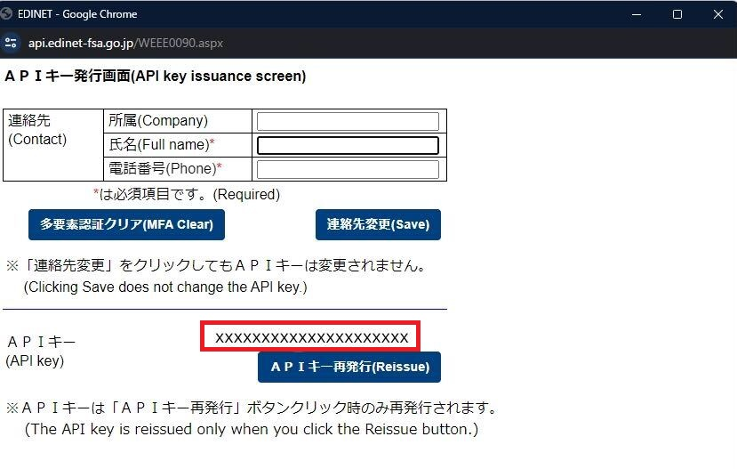

# 本章の目的
前章では、XBRLの全体の概要をメリットなどとともに話したり、XBRLの最大の特徴でもあるタクソノミと抜き出す対象である有価証券報告書の双方の知識を深めることで企業の比較などができるという旨を話しました。

前章の例のように多くの企業を比較分析したい場合、自分の手元にデータがなくては分析ができません。

もし、あなたが使用するデータの数が特定の2, 3件程度であれば、EDINETから直接クリックしてXBRLファイルをダウンロードすれば問題はないでしょう。
しかし、分析をするために100件以上など大量の有報を必要とするのならば、一つずつクリックするのではそれだけで大変な作業です。
少し敷居が高く感じたり、コードに触れる時間がかかるとはいえ、自動でダウンロードした方がより楽だと思えます。

また、自動でダウンロードすることでデータ保有の観点からもメリットが存在します。分析する対象はより多くの、できるのであれば過去のデータがあると嬉しいでしょう。しかし、EDINETの仕様上、取得できる過去データに制限があります。有報であれば10年前までです。そのため、ダウンロードしておき自分の手元にデータを持っておくことで公式からはもうアクセスすることのできないデータを自分は持っているという状況は長い目で見ると非常に大きなメリットになりうるのです。

そこで本章では、大量のデータを自動で集める方法について話していきます。 EDINETから出されているEDINET APIをもとに実際のコードに落とし込みながら説明をします。

またコードにつきましてはQiitaに掲載されているXBRL Japanが公開している『EDINET APIを利用して、企業情報（XBRLデータ）を自動で集めてみよう（4/10）』という記事を参考にさせていただき、一部APIのアップデートによる変更などを加えてにコードを書かせていただきました。

「とりあえず動くことだけ知りたい」といった方はまず、ソースコードを丸写ししてみて下さい。基本的には、ソースコードを写すだけでデータの自動収集が可能となっております。

個別に発行が必要なキーの部分だけ変更していただき、実行して下さい。 もちろん、コードの大まかな解説もしていますので、そちらも確認しながら手元で実行していただけると理解が深まると思います。

なお、この記事の大部分はEDINETの公式から発表されている「EDINET API仕様書 version2」を参考に執筆しております。

# 事前準備
## EDINET APIを使えるようにしよう

まず、有報をダウンロードするために必須のAPI *¹についてです。

EDINET APIとは、使用者が直接EDINETのウェブページに行くのではなく、プログラムを介してEDINETのデータベースから効率的にデータを取得できるAPIです。EDINET APIにより、EDINET利用者は効率的に開示情報を取得することが可能となります。

そんなEDINET APIは2種類あります。

- 書類一覧API

- 書類取得API

の二つです。どちらもEDINET APIです。

書類一覧APIは提出された書類を把握するためのAPIです。
概要としてはEDINETに提出された書類の一覧を取得するAPIとなっています。
基本的には書類一覧APIがあることにより、日付ごとの提出書類の基本情報を参照することで情報を取得できるというわけです。

書類取得APIは提出された書類を取得するためのAPIです。
取得する書類の種類を指定することができます。これにより、これから登場するコラムや応用のようなことが可能となります。
このAPIを使用するにはアカウントを作成し、APIキーというものを発行する必要があります。 これは個人で変わるものなので自分のAPIキーを使用してコードに入れます。コードを回したときにこのAPIを使用してデータを取って来ることが可能となります。

「情報を一覧で見る機能を持つもの」と「取得する機能を持つもの」で分かれているということです。

### 注意点

アカウント作成、APIキーを取得する際にいくつか注意点があります。
正しい手段を踏んでもこの注意点の項目ができていないと、うまくアカウント作成やAPIキーが取れないこともあるので確認してみてください。

なお、EDINET API仕様書ではMicrosoft Edgeでの利用方法が詳しく記載されていましたが、Google Chromeでの設定方法の記載がなく利用者も多いと思うので今回はChromeの説明をします。

Microsoft Edgeご利用の方は以下のURLからダウンロードできるEDINET_API仕様書を参考にしてください。

https://disclosure2dl.edinet-fsa.go.jp/guide/static/disclosure/WZEK0110.html

EDINET操作ガイド　EDINET API仕様書(Version2)　2-1　ポップアップ許可サイトへの追加
最終閲覧日：2024/10/08

(1)ポップアップの設定

Google Chromeを開き右上の三点リーダーをクリックし、その中の「設定」をクリックします。

開いた画面の左のサイドバーから「プライバシーとセキュリティ」をクリックします。 次に画面中央から「サイトの設定」をクリックします。

コンテンツの中の「ポップアップとリダイレクト」をクリックします。

動作のカスタマイズで「ポップアップの送信やリダイレクトの使用を許可するサイト」にEDINET APIサイトのリンクを入れます。

「サイトの追加」画面で「https://api.edinet-fsa.go.jp」を入力し、追加ボタンをクリックします。

これでポップアップの設定は完了です。

終了する際はタブは閉じて大丈夫です。

(2)JavaScriptの設定

上記と同じくChromeの設定を開き、「セキュリティ」をクリックします。

「V8のセキュリティを管理する」をクリックします。

デフォルトの動作が「サイトでのV8オプティマイザーの使用を許可する」にチェックが入っているか確認してください。

以上で、JavaScriptの設定は完了です。 終了する際はタブは閉じて大丈夫です。

(3)Cookieの設定

同じく設定画面を開き、「サードパーティCookie」をクリックします。

「サードパーティCookieを許可する」にチェックが入っていることを確認します。

以上でCookieの設定は完了となります。 終了する際はタブは閉じて大丈夫です。

*1　アプリケーション・プログラミング・インターフェースの略。ソフトウェアやプログラム、Webサービス間をつなぐインターフェースのこと。

### アカウント作成

いよいよアカウント作成です。

アカウントを作成する場合には、以下のURLにアクセスし、サインイン画面を表示させます。

https://api.edinet-fsa.go.jp/api/auth/index.aspx?mode=1

サインイン画面が表示されたら下の「今すぐサインアップ」をクリックします。

サインアップ画面の上のフォームにメールアドレスを入力し、「確認コードを送信」をクリックします。

確認コード入力欄が出るので、メールに送られてくる確認コードを入力してください。 入力出来たら、中央左の「コードの確認」をクリックします。

「新しいコードを送信」は確認コードの再送の際にクリックしてください。

コードが正しく受理されると確認コード入力欄がなくなります。 次に下段のパスワードを設定していきます。 「新しいパスワード」と「新しいパスワードを確認してください」のフォームには同一のパスワードの設定してください。

パスワードはパスワードポリシーに沿っていないとエラーが表示されるので、もし表示された際はそのエラーに沿って修正してください。

パスワードが受理されると、つぎに多要素認証に移ります。

まず「国コード」と「電話番号」をそれぞれ入力したのち、以下のいずれかの多要素認証を行います。

1. SMSによる本人確認 SMSにて通知される確認コードを多要素確認コード入力画面に入力して認証を行う。

2. 自動音声による本人確認 登録した電話番号に発信される自動音声通話を受け取り、音声ガイドに従い、テンキーで「#」を入力することにより認証を行う。

SMSにて受け取った確認コードを入力するとAPIキー発行画面が表示されます。

以上でアカウントの作成が完了です。

続けてAPIキーの発行についてです。

多要素認証でのサインイン後にAPIキー発行画面がポップアップ画面で表示されます。 ※ポップアップ画面が表示されない場合は、事前準備の設定のどれかが正しく設定できていない可能性があります。見直しを推奨します。

連絡先を入力し、「連絡先登録（Save）」をクリックします。 ※2回目以降は以下の画像のように「連絡先変更（Save）」となります。

確認画面の「OK」を2つ押します。

するとAPI発行画面にAPIキーが表示されます。 このAPIキーはコードの中に入れるためコピペできるようにしておいてください。

## コードエディタを使おう
次にプログラムを記述し実行する作業場「コードエディタ」をインストールし、設定していきます。

### VS Codeを使えるようにしよう
コードエディタは様々なものが存在しますが、世の中で広く使われている「VS Code」というものを使用していきます。

では、VS Codeのインストール手順を確認していきましょう。

注意：本書ではwindowsでのセットアップを想定しています

1. VS Code公式サイトに移動し、インストーラーをダウンロード

以下のURLに移動して「Download for Windows」をクリックしてください。

https://code.visualstudio.com/

「VSCodeUserSetup-x64-1.94.0.exe」というファイルがダウンロードできれば成功です。

2. インストーラーによるセットアップ

先ほどダウンロードした.exeファイルをダブルクリックして開いてください。

以下の画像のような画面が出現します。

「同意する」を選択してから「次へ(N)>」をクリックします。

追加の設定画面が表示されます。

全ての項目にチェックをし、「次へ(N)>」をクリックします。

今まで選択した項目と間違えがなければ、「インストール(I)」をクリックしてください。

ソフトウェアのインストールが開始されます。

3. ソフトウェア内でのセットアップ

インストールされた「VS Code」を開いてください。

初期設定では言語が英語になっているため、日本語化を行います。

画面左側にある「拡張機能」ボタンを押してください。

拡張機能のサイドバーが開きます。

検索バーに「japanese」と検索し、一番上に表示される拡張機能をクリックしてください。

「インストール」をクリックし、日本語化する拡張機能をインストールしましょう。

その後右下に再起動を促すポップアップが表示されます。

「Change Language and Restart」と書かれたボタンがあるのでクリックして再起動することで、VS Codeが日本語化されます。

4. VS CodeでのPythonのセットアップ

本書ではプログラミング言語は「Python」を使用します。

よってVS CodeでPythonが使えるようにセットアップを行いましょう。

まずはPython本体のインストールです

以下のサイトから**Python 3.12.3** の「Python installer(64-bit)」をダウンロードしてください。

筆者が現時点でプログラム動作確認済みのバージョンです。

以下のリンクを踏むことで直接ダウンロードが行われます。

https://www.python.org/ftp/python/3.12.3/python-3.12.3-amd64.exe

「Python-3.12.3-amd64.exe」というファイルがダウンロードされるので、そのファイルを開いてください。

以下の画像のような画面が出現します。

**必ず「Add python.exe to PATH」にチェックを付けて**、「Install Now」をクリックしてください。

pcにPythonがダウンロードされます。

※書かれているバージョンは違うものですが、画面は同じものが出てきます。

次にVS CodeでのPythonの設定を行います。

VS Codeを開き、もう一度拡張機能のインストールを行います。

検索バーに「python」と入力し、一番上に出てくる拡張機能をインストールしてください。

以上で最低限の設定は完了です。

あとはご自身でフォルダを作成し、拡張子「ファイル名.py」でPythonファイルを作成することでPythonコードを実行させることができます。

次は、先ほど登録したAPIキーを使ってプログラムを書きましょう。

# たくさんの有報のデータを自動でダウンロードしよう

ソースコード

まず、完成形のコードが以下になります。

    import requests
    import datetime
    import os

    def make_day_list(start_date, end_date):
        print("start_date:", start_date)
        print("end_date:", end_date)
        
        period = end_date - start_date
        period = int(period.days)
        day_list = []
        for d in range(period + 1):
            day = start_date + datetime.timedelta(days=d)
            day_list.append(day)
        
        return day_list

    def make_doc_id_list(day_list):
        securities_report_doc_list = []
        for index, day in enumerate(day_list):
            url = "https://disclosure.edinet-fsa.go.jp/api/v2/documents.json"
            params = {"date": day.strftime("%Y-%m-%d"),
                        "type": 2,
                        "Subscription-Key":"your_subscription_key"# Subscription-Keyは自分のAPIキーを使用
                        }
        
            
            
            res = requests.get(url, params=params)
            json_data = res.json()
            print(day)
            
            if "results" in json_data:
                for num in range(len(json_data["results"])):
                    ordinance_code = json_data["results"][num]["ordinanceCode"]
                    form_code = json_data["results"][num]["formCode"]
                    docInfoEditStatus = json_data["results"][num]["docInfoEditStatus"]
                    
                    if ordinance_code =="010"and form_code =="030000" and docInfoEditStatus !=2:
                        print(json_data["results"][num]["filerName"], json_data["results"][num]["docDescription"],
                            json_data["results"][num]["docID"])
                        securities_report_doc_list.append(json_data["results"][num]["docID"])
                        
        return securities_report_doc_list

    def download_xbrl_in_zip(securities_report_doc_list, number_of_lists):
            # ▼ダウンロードする有報を保存しておく場所を指定。もしなければフォルダを作成する。
        save_dir = "/path/to/download/directory/" # あなたの保存先のパスに変更してください。
        if not os.path.exists(save_dir):
            os.makedirs(save_dir)
        
        for index, doc_id in enumerate(securities_report_doc_list):
            print(doc_id, ":", index + 1, "/", number_of_lists)
            url =f"https://disclosure.edinet-fsa.go.jp/api/v2/documents/{doc_id}"
            params = {"type": 1, 
                        "Subscription-Key":"your_subscription_key"# Subscription-Keyは自分のAPIキーを使用
                        }
            filename = os.path.join(save_dir, f"{doc_id}.zip")
            res = requests.get(url, params=params, stream=True)
            
        try :
            if res.status_code == 200:
                with open(filename, 'wb') as file:
                    for chunk in res.iter_content(chunk_size=1024):
                        file.write(chunk)
                print(f"Downloaded and Saved: {filename}")
        except Exception as e:
            print(f"Failed to download file {doc_id}, status code: {e}")
            
    def main():
        # ▼集める期間
        start_date = datetime.date(2024, 5, 1) # 開始日付
        end_date = datetime.date(2024, 5, 31) # 終了日付
        day_list = make_day_list(start_date, end_date)
        
        securities_report_doc_list = make_doc_id_list(day_list)
        number_of_lists = len(securities_report_doc_list)
        print("number_of_lists: ", number_of_lists)
        print("get_list: ", securities_report_doc_list)
        
        download_xbrl_in_zip(securities_report_doc_list, number_of_lists)
        print("download finish")
        
        
    if __name__ == "__main__":
        main()

実行結果

以下の画像のように2024/5/1~2024/5/31までの一カ月間に提出された有報をダウンロードできました。今回は226件もの有報がほんの15分足らずでダウンロードができました。

もっと多い件数をダウンロードする場合は、サーバーに負荷をかけるためエラーを返されることがあります。少ない件数にするために期間を絞るか、sleep関数などを用いてクールタイムを設けるようにしてみると良いでしょう。

▼ターミナル上でのログの一部

    start_date: 2024-05-01
    end_date: 2024-05-31
    2024-05-01
    2024-05-02
    2024-05-03
    2024-05-04
    2024-05-05
    2024-05-06
    2024-05-07
    2024-05-08
    2024-05-09
    2024-05-10
    2024-05-11
    2024-05-12
    2024-05-13
    株式会社あさひ 有価証券報告書－第49期(2023/02/21－2024/02/20) S100TCYC
    2024-05-14
    2024-05-15
    株式会社西松屋チェーン 有価証券報告書－第68期(2023/02/21－2024/02/20) S100TF9K
    株式会社オークワ 有価証券報告書－第55期(2023/02/21－2024/02/20) S100TEV9
    2024-05-16
    株式会社　セキチュー 有価証券報告書－第73期(2023/02/21－2024/02/20) S100TG3H
    2024-05-17
    パレモ・ホールディングス株式会社 有価証券報告書－第39期(2023/02/21－2024/02/20) S100TG6Z
    株式会社フジ 有価証券報告書－第57期(2023/03/01－2024/02/29) S100TGC6
    株式会社　平和堂 有価証券報告書－第67期(2023/02/21－2024/02/20) S100TGDM
    株式会社瑞光 有価証券報告書－第61期(2023/02/21－2024/02/20) S100TGHZ
    2024-05-18
    2024-05-19
    2024-05-20
    株式会社サンデー 有価証券報告書－第50期(2023/03/01－2024/02/29) S100TGOR
    株式会社しまむら 有価証券報告書－第71期(2023/02/21－2024/02/20) S100TGLZ
    2024-05-21
    株式会社ＮａＩＴＯ 有価証券報告書－第73期(2023/03/01－2024/02/29) S100TGUF
    2024-05-22
    スギホールディングス株式会社 有価証券報告書－第42期(2023/03/01－2024/02/29) S100TGZR
    株式会社ニューテック 有価証券報告書－第42期(2023/03/01－2024/02/29) S100TH19
    株式会社リンガーハット 有価証券報告書－第60期(2023/03/01－2024/02/29) S100TGO1
    株式会社イオンファンタジー 有価証券報告書－第28期(2023/03/01－2024/02/29) S100TH6B
    株式会社ローソン 有価証券報告書－第49期(2023/03/01－2024/02/29) S100TH3U
    株式会社エディア 有価証券報告書－第25期(2023/03/01－2024/02/29) S100TH85
                                                                        ・
                                                                        ・
                                                            　　　　　　(省略）
                                                                        ・
                                                                        ・
    S100TJL9 : 226 / 226
    Downloaded and Saved: /path/to/download/directory/S100TJL9.zip
    Downloaded and Saved: /path/to/download/directory/S100TJL9.zip
    download finish
    download finish

裏ではもっと細かい情報についてもまとめてくれています。

▼指定したディレクトリでも保存を確認

実際に分析する際はこのzipファイルを解凍してから使用します。

変更が必要なコード

(1)日付を指定する

main関数の中で日付のリストを作成します。 そのリストに入る値をstart_dateとend_dateで取ってきたい期間を指定してあげます。

あまりに長いとサーバーに負担をかけてしまい、時間がかかるだけでなくエラーになってしまう場合もあるため、1ヵ月単位などで取って来ることをおすすめします。 また、6月は前年度の有報の提出期限ということもあり、6月は特に多いですので注意してください。

▼集める期間
    start_date = datetime.date(2024, 5, 1) # 開始日付　随時変更
    end_date = datetime.date(2024, 5, 31) # 終了日付　随時変更
    day_list = make_day_list(start_date, end_date)

(2)保存先の指定

download_xbrl_in_zip関数のsave_dirで保存先の指定をしてください。

    def download_xbrl_in_zip(securities_report_doc_list, number_of_lists):
            # ▼ダウンロードする有報を保存しておく場所を指定。もしなければフォルダを作成する。
        save_dir = "/path/to/download/directory/" # あなたの保存先のパスに変更してください。

(3)APIキーの設置

make_doc_id_list関数とdownload_xbrl_in_zip関数の2つの関数の中のparamsという変数の中でAPIキー（Subscription-Key）を先ほど取得したAPIキーとして記入してください。

以下コードでは「” ”」で囲まれたyour_subscription_keyの部分をご自身のAPIキーに変更して下さい。

▼make_doc_id_list関数

    def make_doc_id_list(day_list):
        securities_report_doc_list = []
        for index, day in enumerate(day_list):
            url = "https://disclosure.edinet-fsa.go.jp/api/v2/documents.json"
            params = {"date": day.strftime("%Y-%m-%d"), "type": 2, "Subscription-Key":"your_subscription_key"} # Subscription-Keyは自分のAPIキーを使用

▼download_xbrl_in_zip関数の中のfor文

    for index, doc_id in enumerate(securities_report_doc_list):
            print(doc_id, ":", index + 1, "/", number_of_lists)
            url =f"https://disclosure.edinet-fsa.go.jp/api/v2/documents/{doc_id}"
            params = {"type": 1,  "Subscription-Key":"your_subscription_key"} # Subscription-Keyは自分のAPIキーを使用

解説

- 書類を取得してくる関数

make_doc_id_list関数では、各日付についてEDINET APIを呼び出し、有報ひとつずつに付けられているドキュメントIDを収集します。このAPIを呼び出す際にAPIキーが必要となるため、取得してもらいました。 paramsの”type”は取得情報の指定をしており、２は提出一覧およびメタデータの取得を指します。これにより、後続の処理で有価証券報告書を特定できます。

また、途中で指定しているordinance_codeとform_codeはそれぞれ府令コードと様式コードを指すものであり、今回は有価証券報告書を取得したいためordinance_code=010, form_code=30000を指定することで有価証券報告書のみを取得できるようにしています。

そしてdocInfoEditStatusは書類情報修正区分を示すものであり、財務局員が書類を修正した場合に修正前の書類にはこの書類情報修正区分の数値に2が割り当てられます。

最新の書類を取得したいためdocInfoEditStatus !=2で修正前の書類を取得せずに処理を行うようにしています。

該当した提出書類のDocID（書類管理番号）を取得しsecurities_report_doc_list（有報のリスト）に格納します。

    def make_doc_id_list(day_list):
        securities_report_doc_list = []
        for index, day in enumerate(day_list):
            url = "https://disclosure.edinet-fsa.go.jp/api/v2/documents.json"
            params = {"date": day.strftime("%Y-%m-%d"), "type": 2, "Subscription-Key":"your_subscription_key"}
            res = requests.get(url, params=params)
            json_data = res.json()
            
            if "results" in json_data:
                for num in range(len(json_data["results"])):
                    ordinance_code = json_data["results"][num]["ordinanceCode"]
                    form_code = json_data["results"][num]["formCode"]
                    docInfoEditStatus = json_data["results"][num]["docInfoEditStatus"]
                    
                    if ordinance_code =="010"and form_code =="030000" and docInfoEditStatus !=2:
                        print(json_data["results"][num]["filerName"], json_data["results"][num]["docDescription"],
                            json_data["results"][num]["docID"])
                        securities_report_doc_list.append(json_data["results"][num]["docID"])
        return securities_report_doc_list

- ZIP形式でダウンロードする関数

download_xbrl_in_zip関数では各ドキュメントIDについてAPIを呼び出しXBRLファイルをZIP形式でダウンロードし、指定された場所に保存します。 paramsの”type”は取得情報の指定をしており、１はメタデータのみを取得するものです。つまり、提出された書類の本文と監査報告書を取得することができます。

resのステータスコードが200はリクエスト成功を意味し、成功したもののみXBRLファイルをダウンロードしています。このダウンロード時に各ファイルはZIP形式で保存され、ファイル名はドキュメントIDになります。

    def download_xbrl_in_zip(securities_report_doc_list, number_of_lists):
            # ▼ダウンロードする有報を保存しておく場所を指定。もしなければフォルダを作成する。
        save_dir = "/path/to/download/directory/"# あなたの保存先のパスに変更してください。
        if not os.path.exists(save_dir):
            os.makedirs(save_dir)
        
        for index, doc_id in enumerate(securities_report_doc_list):
            url = f"https://disclosure.edinet-fsa.go.jp/api/v2/documents/{doc_id}"
            params = {"type": 1, "Subscription-Key":"your_subscription_key"}
            filename = os.path.join(save_dir, f"{doc_id}.zip")
            res = requests.get(url, params=params, stream=True)
            
        try :
            if res.status_code == 200:
                with open(filename, 'wb') as file:
                    for chunk in res.iter_content(chunk_size=1024):
                        file.write(chunk)
                print(f"Downloaded and Saved: {filename}")
        except Exception as e:
            print(f"Failed to download file {doc_id}, status code: {e}")

以上がざっくりとしたコードの解説になります。

# コラム：フィルタリングしてダウンロードのできるできない

上記で書類取得APIには取得する書類の種類を指定することができると話しました。

その機能を活かすと、次のように分類ができるでしょう。

**簡単にできる**

- 提出日

そもそも書類一覧APIが日付ごとに取ってきているので、これがないといけないくらいの位置づけです。簡単にできるよりも指定しなければいけないが正しいかもしれないですね。

**できる**

- 提出者名/ファンド

- 提出書類の種類

- 投資信託であるかどうか

**できない**

- 業種

- 会社の規模

- 資本の大きさ

- 従業員数

- 企業年数

- 株式の保有数

これらの分別は書類一覧APIで取れるメタデータに含まれるか含まれないかです。 一度、書類一覧APIで指定された期間の書類をすべて取り出します。 そこからメタデータに含まれる情報をもとにフィルタリングをかけ、書類取得APIで該当するデータをダウンロードするというような流れというわけです。

# 応用：フォルダ名を企業名にしてダウロード

上記までは、ダウンロードしたフォルダが有報のドキュメントIDという書類それぞれに付与された番号でラベリングされていましたね。

これではデータを選り好みして分析したいなどという場合にフォルダをいちいち開かないとどの企業のものかわかりません。 そこで以下のコードではフォルダの名前をドキュメントIDではなく、企業名にした状態でダウンロードするということに挑戦します。

この部分は、ダウンロードができた前提のプラスαの機能ですので必須なものではありません。 もし興味のある方はぜひコードに触れ、試してみてください。

完成形のコードは以下です。

先ほどのソースコードを少し変更し、企業名でファイルが保存できるようにします。

    import requests
    import datetime
    import os 

    def make_day_list(start_date, end_date):
        print("start_date:", start_date)
        print("end_date:", end_date)
        
        period = end_date - start_date
        period = int(period.days)
        day_list = []
        for d in range(period + 1):
            day = start_date + datetime.timedelta(days=d)
            day_list.append(day)
        
        return day_list

    def make_doc_id_list(day_list):
        securities_report_DocAndFilename_list = []
        for index, day in enumerate(day_list):
            url = "https://disclosure.edinet-fsa.go.jp/api/v2/documents.json"
            params = {"date": day.strftime("%Y-%m-%d"), "type": 2, "Subscription-Key":"your_subscription_key"} # Subscription-Keyは自分のAPIキーを使用
        
            
            
            res = requests.get(url, params=params)
            json_data = res.json()
            print(day)
            
            if "results" in json_data:
                for num in range(len(json_data["results"])):
                    ordinance_code = json_data["results"][num]["ordinanceCode"]
                    form_code = json_data["results"][num]["formCode"]
                    docInfoEditStatus = json_data["results"][num]["docInfoEditStatus"]
                    
                    if ordinance_code =="010"and form_code =="030000" and docInfoEditStatus !=2:
                        print(json_data["results"][num]["filerName"], json_data["results"][num]["docDescription"],
                            json_data["results"][num]["docID"])
                        #変更：doc_idとfilenameを辞書型で保有する
                        data = {"doc_id":json_data["results"][num]["docID"],
                                "filename":json_data["results"][num]["filerName"]}
                        securities_report_DocAndFilename_list.append(data)
                        
        return securities_report_DocAndFilename_list

    def download_xbrl_in_zip(securities_report_DocAndFilename_list, number_of_lists):
            # ▼ダウンロードする有報を保存しておく場所を指定。もしなければフォルダを作成する。
        save_dir = "/path/to/download/directory/"# あなたの保存先のパスに変更してください。
        if not os.path.exists(save_dir):
            os.makedirs(save_dir)
        
        for index, doc_and_filename in enumerate(securities_report_DocAndFilename_list):
            #変更：辞書からdoc_idとfilenameを取り出す
            doc_id = doc_and_filename.get("doc_id")
            name = doc_and_filename.get("filename")
            print(doc_id, ":", index + 1, "/", number_of_lists)
            url =f"https://disclosure.edinet-fsa.go.jp/api/v2/documents/{doc_id}"
            params = {"type": 1,  "Subscription-Key":"your_subscription_key"} # Subscription-Keyは自分のAPIキーを使用
            filename = os.path.join(save_dir, f"{name}.zip")
            res = requests.get(url, params=params, stream=True)
            
            try :
                if res.status_code == 200:
                    with open(filename, 'wb') as file:
                        for chunk in res.iter_content(chunk_size=1024):
                            file.write(chunk)
                    print(f"Downloaded and Saved: {filename}")
            except Exception as e:
                print(f"Failed to download file {doc_id}, status code: {e}") 
            
    def main():
        # ▼▼▼集める期間▼▼▼
        start_date = datetime.date(2024, 5, 1) # 随時変更
        end_date = datetime.date(2024, 5, 31) # 随時変更
        day_list = make_day_list(start_date, end_date)
        
        securities_report_doc_list = make_doc_id_list(day_list)
        number_of_lists = len(securities_report_doc_list)
        print("number_of_lists: ", number_of_lists)
        print("get_list: ", securities_report_doc_list)
        
        download_xbrl_in_zip(securities_report_doc_list, number_of_lists)
        print("download finish")
        
        
    if __name__ == "__main__":
        main()

解説：ソースコードの変更点

1. 書類を取得してくる関数

変更前のコードではEDINET APIを利用して取得したメタデータの中からドキュメントID、府令コード、様式コードを抜き出しその3つの数値を利用しましたね。

ここの関数で３つの数値とさらに企業名を抜き出すコードに変更をしました。

変更前のコードではsecurities_report_doc_listにDocIDのみの数値を入れていますが、

変更後のコードではsecurities_report_DocAndFilename_listにDocIDと企業名２種類の数値をセットで格納しています。

また、企業名はメタデータの中ではfilerNameとして保存されているので、指定して抜き出します。

▼変更前のソースコード

    def make_doc_id_list(day_list):
        securities_report_doc_list = []
        for index, day in enumerate(day_list):
            url = "https://disclosure.edinet-fsa.go.jp/api/v2/documents.json"
            params = {"date": day.strftime("%Y-%m-%d"), "type": 2, "Subscription-Key":"your_subscription_key"}
            res = requests.get(url, params=params)
            json_data = res.json()
            
            if "results" in json_data:
                for num in range(len(json_data["results"])):
                    ordinance_code = json_data["results"][num]["ordinanceCode"]
                    form_code = json_data["results"][num]["formCode"]
                    docInfoEditStatus = json_data["results"][num]["docInfoEditStatus"]
                    
                    if ordinance_code =="010"and form_code =="030000" and docInfoEditStatus !=2:
                        print(json_data["results"][num]["filerName"], json_data["results"][num]["docDescription"],
                            json_data["results"][num]["docID"])
                        securities_report_doc_list.append(json_data["results"][num]["docID"])
        return securities_report_doc_list

▼変更後のソースコード

    def make_doc_id_list(day_list):
        securities_report_DocAndFilename_list = []
        for index, day in enumerate(day_list):
            url = "https://disclosure.edinet-fsa.go.jp/api/v2/documents.json"
            params = {"date": day.strftime("%Y-%m-%d"), "type": 2, "Subscription-Key":"your_subscription_key"} # Subscription-Keyは自分のAPIキーを使用
        
            
            
            res = requests.get(url, params=params)
            json_data = res.json()
            print(day)
            
            if "results" in json_data:
                for num in range(len(json_data["results"])):
                    ordinance_code = json_data["results"][num]["ordinanceCode"]
                    form_code = json_data["results"][num]["formCode"]
                    docInfoEditStatus = json_data["results"][num]["docInfoEditStatus"]
                    
                    if ordinance_code =="010"and form_code =="030000" and docInfoEditStatus !=2:
                        print(json_data["results"][num]["filerName"], json_data["results"][num]["docDescription"],
                            json_data["results"][num]["docID"])
                        #変更：doc_idとfilenameを辞書型で保有する
                        data = {"doc_id":json_data["results"][num]["docID"],
                                "filename":json_data["results"][num]["filerName"]}
                        securities_report_DocAndFilename_list.append(data)
                        
        return securities_report_DocAndFilename_list

2. ZIP形式でダウンロードする関数

変更前のコードと比べ、EDINET APIを使用しresを受け取る処理には大きく変更点はありません。

変更前のコードとの違いは”doc_idのみを抜き出しているか”、”doc_idとfilenameをセットで抜き出しているか”です。

変更後のコードではdoc_idとfilenameをセットで1つの変数に辞書型として格納しているため、それぞれを独立させて使用するためにgetメソッドを用いて辞書から抜き出します。

その後EDINET APIの操作ではdoc_idを使用し、ファイルの保存でfilenameを使用しています。

ファイルを保存する段階でfilenameを利用することでfilenameに格納されている会社名で保存をすることが可能になります。

▼変更前のコード

    def download_xbrl_in_zip(securities_report_doc_list, number_of_lists):
            # ▼ダウンロードする有報を保存しておく場所を指定。もしなければフォルダを作成する。
        save_dir = "/path/to/download/directory/"# あなたの保存先のパスに変更してください。
        if not os.path.exists(save_dir):
            os.makedirs(save_dir)
        
        for index, doc_id in enumerate(securities_report_doc_list):
            url = f"https://disclosure.edinet-fsa.go.jp/api/v2/documents/{doc_id}"
            params = {"type": 1, "Subscription-Key":"your_subscription_key"}
            filename = os.path.join(save_dir, f"{doc_id}.zip")
            res = requests.get(url, params=params, stream=True)
            
            try :
                if res.status_code == 200:
                    with open(filename, 'wb') as file:
                        for chunk in res.iter_content(chunk_size=1024):
                            file.write(chunk)
                    print(f"Downloaded and Saved: {filename}")
            except Exception as e:
                print(f"Failed to download file {doc_id}, status code: {e}")

▼変更後のコード

    def download_xbrl_in_zip(securities_report_DocAndFilename_list, number_of_lists):
            # ▼ダウンロードする有報を保存しておく場所を指定。もしなければフォルダを作成する。
        save_dir = "/path/to/download/directory/"# あなたの保存先のパスに変更してください。
        if not os.path.exists(save_dir):
            os.makedirs(save_dir)
        
        for index, doc_and_filename in enumerate(securities_report_DocAndFilename_list):
            #変更：辞書からdoc_idとfilenameを取り出す
            doc_id = doc_and_filename.get("doc_id")
            name = doc_and_filename.get("filename")
            print(doc_id, ":", index + 1, "/", number_of_lists)
            url =f"https://disclosure.edinet-fsa.go.jp/api/v2/documents/{doc_id}"
            params = {"type": 1,  "Subscription-Key":"your_subscription_key"} # Subscription-Keyは自分のAPIキーを使用
            #変更：ファイル名がname変数を適用した形になるようにする
            filename = os.path.join(save_dir, f"{name}.zip")
            res = requests.get(url, params=params, stream=True)
            
            try :
                if res.status_code == 200:
                    with open(filename, 'wb') as file:
                        for chunk in res.iter_content(chunk_size=1024):
                            file.write(chunk)
                    print(f"Downloaded and Saved: {filename}")
            except Exception as e:
                print(f"Failed to download file {doc_id}, status code: {e}")

結果

Before

After

このようにちょっとした工夫で、フォルダ名をドキュメントIDから企業名に変更することができます。

# まとめ
今回、一度に大量のデータをダウンロードすることについて話しました。

一つひとつダウンロードして中身を確認する手間が省けるので、コードを書く時間が少しかかるとは言え、プログラムを回す方が圧倒的に楽だと思います。 もし興味が出てきましたら、このコードをもとに色々いじって使いやすいようにしてみてください。コードはGithubにも置いてあります。

さて次章からこのデータを使用して、ついにデータ分析をしていこうと思います。