# 本章の目的
次の4章では、プログラミング言語「Python」を用いたXBRLの自動取得を行います。

また、5章以降ではPythonを用いたXBRLからの情報抽出について説明をします。

そこで本章ではプログラムを使用するために、”プログラミングで利用する「EDINET API」の準備”と”プログラムを動作させるためのソフトウェアの環境構築”について説明します。

もうすでにEDINET APIの利用方法をご存じの方・Pythonが利用可能な状態にある方は、この章は読ますに次章から読み進めていただいて大丈夫です。

なお、この記事の大部分はEDINETの公式から発表されている「EDINET API仕様書 version2」を参考に執筆しております。

# EDINET APIを使えるようにしよう

まず、有報をダウンロードするために必須のAPI *¹についてです。

EDINET APIとは、使用者が直接EDINETのウェブページに行くのではなく、プログラムを介してEDINETのデータベースから効率的にデータを取得できるAPIです。EDINET APIにより、EDINET利用者は効率的に開示情報を取得することが可能となります。

そんなEDINET APIは2種類あります。

- 書類一覧API

- 書類取得API

の二つです。どちらもEDINET APIです。

書類一覧APIは提出された書類を把握するためのAPIです。
概要としてはEDINETに提出された書類の一覧を取得するAPIとなっています。
基本的には書類一覧APIがあることにより、日付ごとの提出書類の基本情報を参照することで情報を取得できるというわけです。

書類取得APIは提出された書類を取得するためのAPIです。
取得する書類の種類を指定することができます。これにより、これから登場するコラムや応用のようなことが可能となります。
このAPIを使用するにはアカウントを作成し、APIキーというものを発行する必要があります。 これは個人で変わるものなので自分のAPIキーを使用してコードに入れます。コードを回したときにこのAPIを使用してデータを取って来ることが可能となります。

「情報を一覧で見る機能を持つもの」と「取得する機能を持つもの」で分かれているということです。

## 注意点

アカウント作成、APIキーを取得する際にいくつか注意点があります。
正しい手段を踏んでもこの注意点の項目ができていないと、うまくアカウント作成やAPIキーが取れないこともあるので確認してみてください。

なお、EDINET API仕様書ではMicrosoft Edgeでの利用方法が詳しく記載されていましたが、Google Chromeでの設定方法の記載がなく利用者も多いと思うので今回はChromeの説明をします。

Microsoft Edgeご利用の方は以下のURLからダウンロードできるEDINET_API仕様書を参考にしてください。

https://disclosure2dl.edinet-fsa.go.jp/guide/static/disclosure/WZEK0110.html

EDINET操作ガイド　EDINET API仕様書(Version2)　2-1　ポップアップ許可サイトへの追加
最終閲覧日：2024/10/08

(1)ポップアップの設定

Google Chromeを開き右上の三点リーダーをクリックし、その中の「設定」をクリックします。

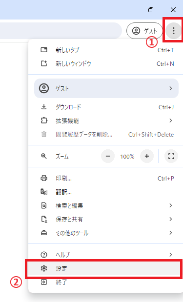

開いた画面の左のサイドバーから「プライバシーとセキュリティ」をクリックします。 次に画面中央から「サイトの設定」をクリックします。

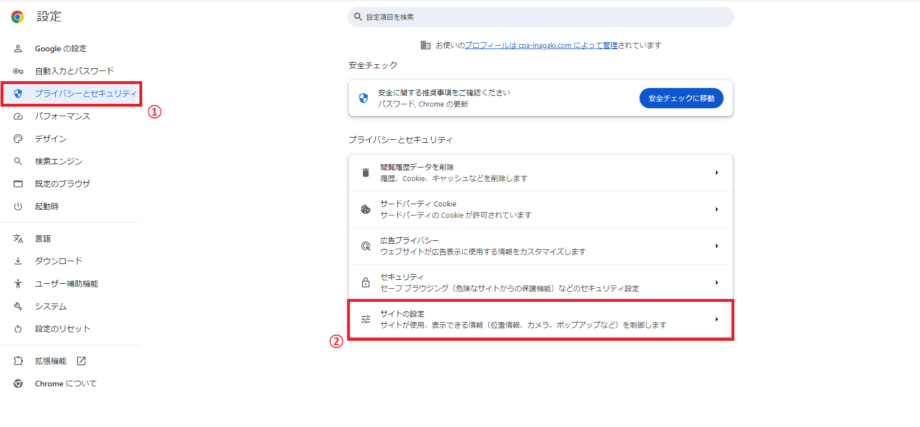

コンテンツの中の「ポップアップとリダイレクト」をクリックします。

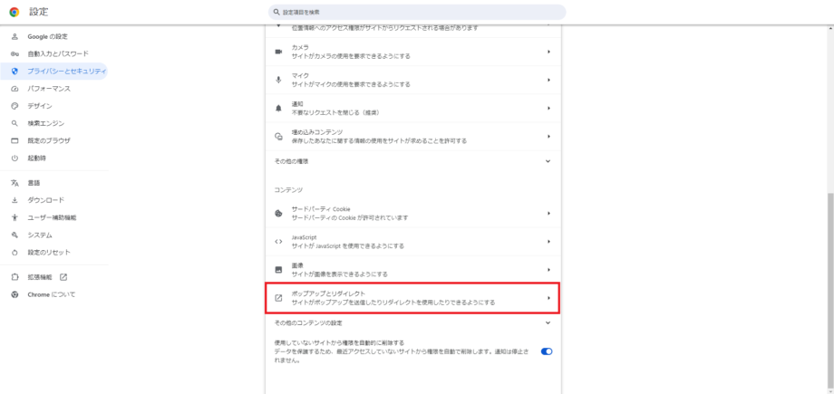

動作のカスタマイズで「ポップアップの送信やリダイレクトの使用を許可するサイト」にEDINET APIサイトのリンクを入れます。

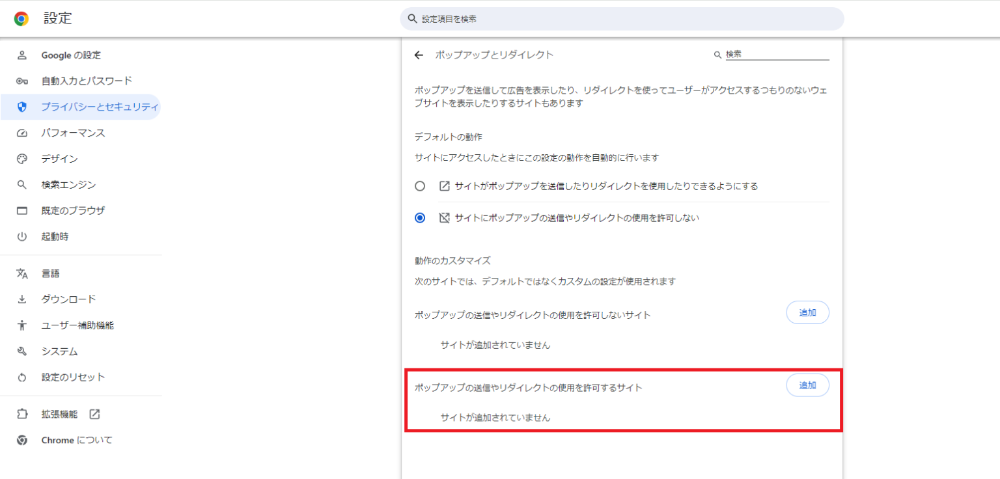

「サイトの追加」画面で「https://api.edinet-fsa.go.jp」を入力し、追加ボタンをクリックします。

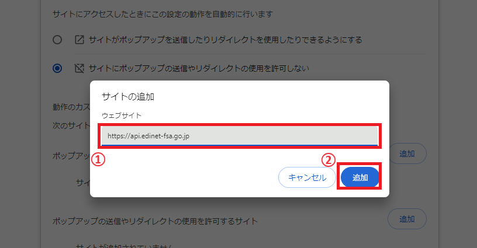

これでポップアップの設定は完了です。

終了する際はタブは閉じて大丈夫です。

(2)JavaScriptの設定

上記と同じくChromeの設定を開き、「セキュリティ」をクリックします。

「V8のセキュリティを管理する」をクリックします。

デフォルトの動作が「サイトでのV8オプティマイザーの使用を許可する」にチェックが入っているか確認してください。

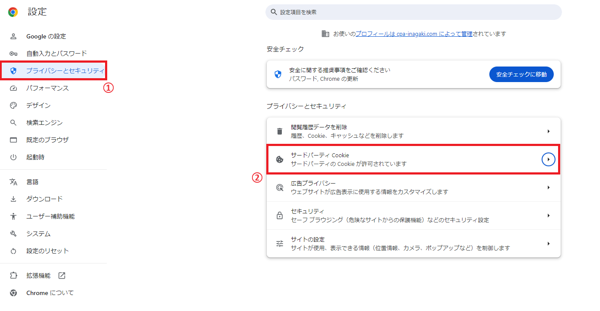

以上で、JavaScriptの設定は完了です。 終了する際はタブは閉じて大丈夫です。

(3)Cookieの設定

同じく設定画面を開き、「サードパーティCookie」をクリックします。

「サードパーティCookieを許可する」にチェックが入っていることを確認します。

以上でCookieの設定は完了となります。 終了する際はタブは閉じて大丈夫です。

*1　アプリケーション・プログラミング・インターフェースの略。ソフトウェアやプログラム、Webサービス間をつなぐインターフェースのこと。

## アカウント作成

いよいよアカウント作成です。

アカウントを作成する場合には、以下のURLにアクセスし、サインイン画面を表示させます。

https://api.edinet-fsa.go.jp/api/auth/index.aspx?mode=1

サインイン画面が表示されたら下の「今すぐサインアップ」をクリックします。

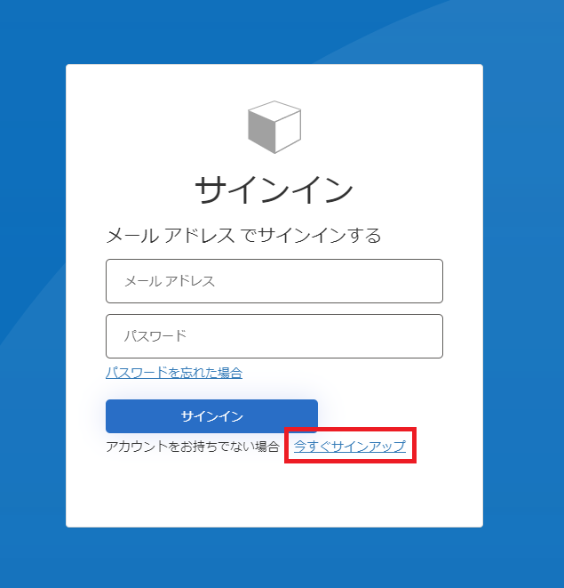

サインアップ画面の上のフォームにメールアドレスを入力し、「確認コードを送信」をクリックします。

確認コード入力欄が出るので、メールに送られてくる確認コードを入力してください。 入力出来たら、中央左の「コードの確認」をクリックします。

「新しいコードを送信」は確認コードの再送の際にクリックしてください。

コードが正しく受理されると確認コード入力欄がなくなります。 次に下段のパスワードを設定していきます。 「新しいパスワード」と「新しいパスワードを確認してください」のフォームには同一のパスワードの設定してください。

パスワードはパスワードポリシーに沿っていないとエラーが表示されるので、もし表示された際はそのエラーに沿って修正してください。

パスワードが受理されると、つぎに多要素認証に移ります。

まず「国コード」と「電話番号」をそれぞれ入力したのち、以下のいずれかの多要素認証を行います。

1. SMSによる本人確認 SMSにて通知される確認コードを多要素確認コード入力画面に入力して認証を行う。

2. 自動音声による本人確認 登録した電話番号に発信される自動音声通話を受け取り、音声ガイドに従い、テンキーで「#」を入力することにより認証を行う。

SMSにて受け取った確認コードを入力するとAPIキー発行画面が表示されます。

以上でアカウントの作成が完了です。

続けてAPIキーの発行についてです。

多要素認証でのサインイン後にAPIキー発行画面がポップアップ画面で表示されます。 ※ポップアップ画面が表示されない場合は、事前準備の設定のどれかが正しく設定できていない可能性があります。見直しを推奨します。

連絡先を入力し、「連絡先登録（Save）」をクリックします。 ※2回目以降は以下の画像のように「連絡先変更（Save）」となります。

確認画面の「OK」を2つ押します。

するとAPI発行画面にAPIキーが表示されます。 このAPIキーはコードの中に入れるためコピペできるようにしておいてください。

# コードエディタを使おう
次にプログラムを記述し実行する作業場「コードエディタ」をインストールし、設定していきます。

## VS Codeを使えるようにしよう
コードエディタは様々なものが存在しますが、世の中で広く使われている「VS Code」というものを使用していきます。

では、VS Codeのインストール手順を確認していきましょう。

注意：本書ではwindowsでのセットアップを想定しています

1. VS Code公式サイトに移動し、インストーラーをダウンロード

以下のURLに移動して「Download for Windows」をクリックしてください。

https://code.visualstudio.com/

「VSCodeUserSetup-x64-1.94.0.exe」というファイルがダウンロードできれば成功です。

2. インストーラーによるセットアップ

先ほどダウンロードした.exeファイルをダブルクリックして開いてください。

以下の画像のような画面が出現します。

「同意する」を選択してから「次へ(N)>」をクリックします。

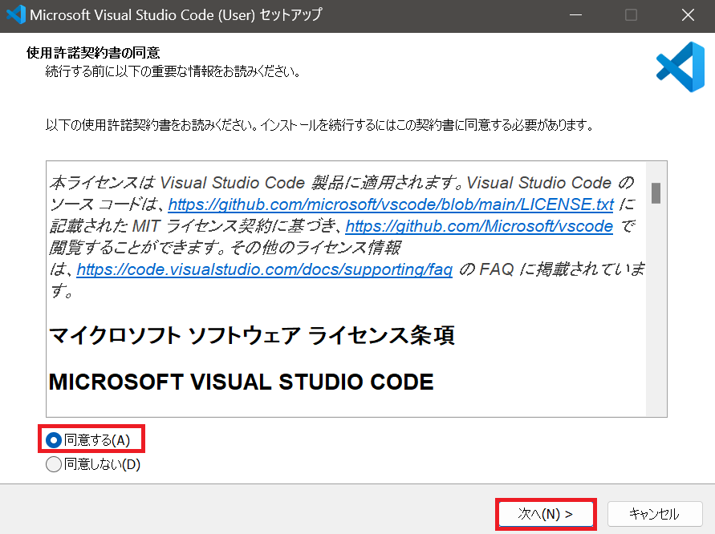

追加の設定画面が表示されます。

全ての項目にチェックをし、「次へ(N)>」をクリックします。

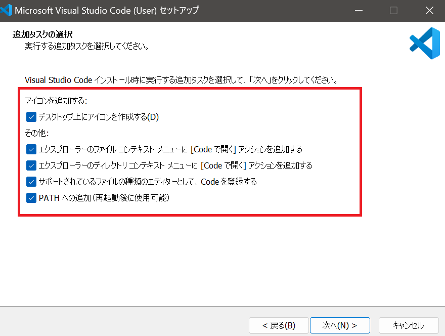

今まで選択した項目と間違えがなければ、「インストール(I)」をクリックしてください。

ソフトウェアのインストールが開始されます。

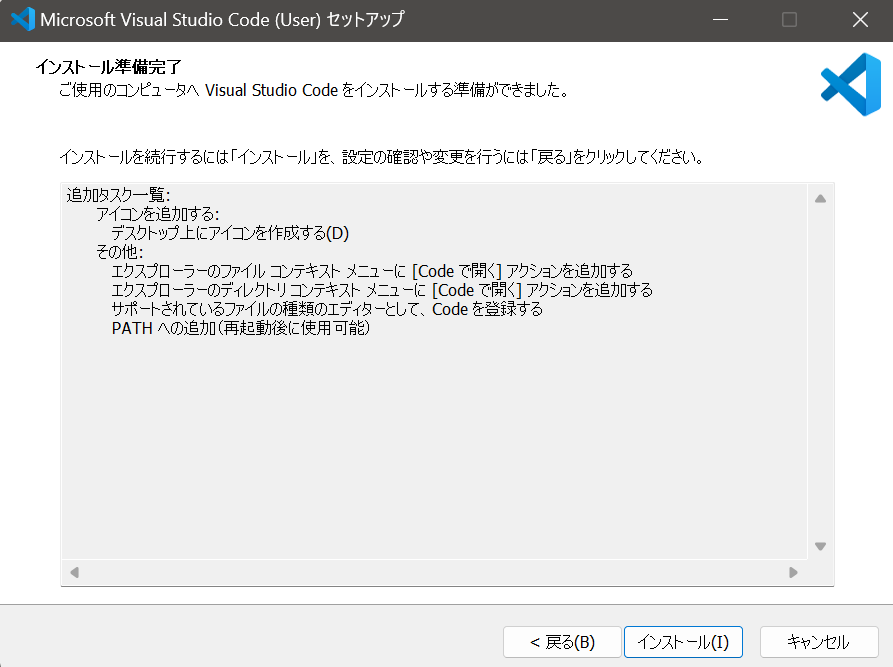

3. ソフトウェア内でのセットアップ

インストールされた「VS Code」を開いてください。

初期設定では言語が英語になっているため、日本語化を行います。

画面左側にある「拡張機能」ボタンを押してください。

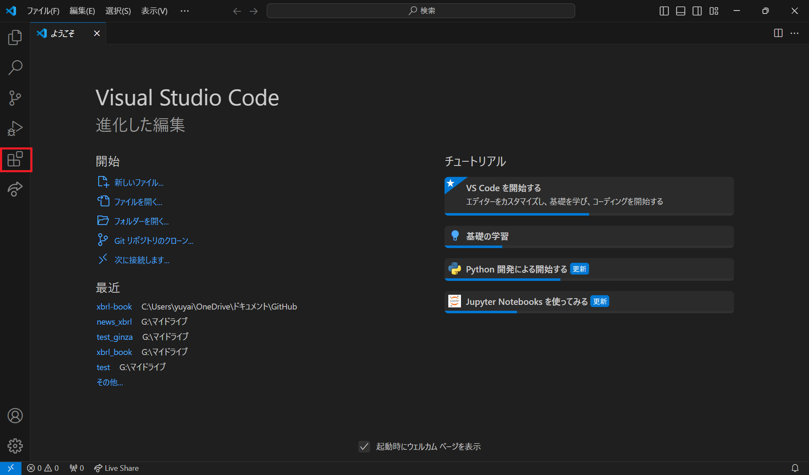

拡張機能のサイドバーが開きます。

検索バーに「japanese」と検索し、一番上に表示される拡張機能をクリックしてください。

「インストール」をクリックし、日本語化する拡張機能をインストールしましょう。

その後右下に再起動を促すポップアップが表示されます。

「Change Language and Restart」と書かれたボタンがあるのでクリックして再起動することで、VS Codeが日本語化されます。

4. VS CodeでのPythonのセットアップ

本書ではプログラミング言語は「Python」を使用します。

よってVS CodeでPythonが使えるようにセットアップを行いましょう。

まずはPython本体のインストールです

以下のサイトから**Python 3.12.3** の「Python installer(64-bit)」をダウンロードしてください。

筆者が現時点でプログラム動作確認済みのバージョンです。

以下のリンクを踏むことで直接ダウンロードが行われます。

https://www.python.org/ftp/python/3.12.3/python-3.12.3-amd64.exe

「Python-3.12.3-amd64.exe」というファイルがダウンロードされるので、そのファイルを開いてください。

以下の画像のような画面が出現します。

**必ず「Add python.exe to PATH」にチェックを付けて**、「Install Now」をクリックしてください。

pcにPythonがダウンロードされます。

※書かれているバージョンは違うものですが、画面は同じものが出てきます。

次にVS CodeでのPythonの設定を行います。

VS Codeを開き、もう一度拡張機能のインストールを行います。

検索バーに「python」と入力し、一番上に出てくる拡張機能をインストールしてください。

以上で最低限の設定は完了です。

あとはご自身でフォルダを作成し、拡張子「ファイル名.py」でPythonファイルを作成することでPythonコードを実行させることができます。

# まとめ
以上で次章以降においてプログラミングをするための準備が整いました。

プログラミングを利用することでより効率的に分析を行うことが可能になります。

次の章では、データを分析するための大量のデータを収集してみます。
1カ月単位の大量の有報を自動で取得できるようになりましょう。
