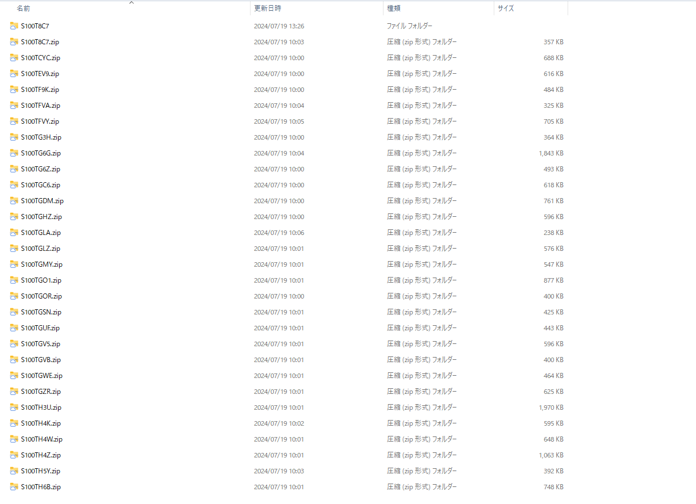

# たくさんの有報を自動でダウンロードしよう

これまでの章で、XBRLデータを用いた分析をするためには、タクソノミやタグといったXBRL自体の知識と、有価証券報告書等の提出書類に対する知識が必要と解説しました。これらの知識を組み合わせることにより、XBRLを用いた企業分析が出来るようになります。
企業間の比較分析などを行うためには、比較のために多くのXBRLデータをダウンロードする必要がありますが、そのためにはプログラムを用いて自動でデータ取得を行うようにすると有用でしょう。
そこで、本章では、EDINET APIを用いて、多くの企業のデータを集める方法について解説していきます。コードについてはGitHub上に掲載されておりますが、可能であれば自ら手を動かしてコードを書いてみてみましょう。

## たくさんの有報のデータを自動でダウンロードしよう

### ソースコードの中身

まず、完成形のコードが以下になります。

```python
import requests
import datetime
import os

def make_day_list(start_date, end_date):
    print("start_date:", start_date)
    print("end_date:", end_date)

    period = end_date - start_date
    period = int(period.days)
    day_list = []
    for d in range(period + 1):
        day = start_date + datetime.timedelta(days=d)
        day_list.append(day)

    return day_list

def make_doc_id_list(day_list):
    securities_report_doc_list = []
    for index, day in enumerate(day_list):
        url = "https://disclosure.edinet-fsa.go.jp/api/v2/documents.json"
        params = {"date": day.strftime("%Y-%m-%d"),
                    "type": 2,
                    "Subscription-Key":"your_subscription_key"
                    # Subscription-Keyは自分のAPIキーを使用
                    }


        res = requests.get(url, params=params)
        json_data = res.json()
        print(day)

        if "results" in json_data:
            for num in range(len(json_data["results"])):
                ordinance_code = json_data["results"][num]["ordinanceCode"]
                form_code = json_data["results"][num]["formCode"]
                docInfoEditStatus = json_data["results"][num]["docInfoEditStatus"]

                if ordinance_code =="010"and form_code =="030000" and docInfoEditStatus !=2:
                    print(json_data["results"][num]["filerName"], json_data["results"][num]["docDescription"],
                        json_data["results"][num]["docID"])
                    securities_report_doc_list.append(json_data["results"][num]["docID"])

    return securities_report_doc_list

def download_xbrl_in_zip(securities_report_doc_list, number_of_lists):
    # ▼ダウンロードする有報を保存しておく場所を指定。もしなければフォルダを作成する。
    save_dir = "/path/to/download/directory/" # あなたの保存先のパスに変更してください。
    if not os.path.exists(save_dir):
        os.makedirs(save_dir)

    for index, doc_id in enumerate(securities_report_doc_list):
        print(doc_id, ":", index + 1, "/", number_of_lists)
        url =f"https://disclosure.edinet-fsa.go.jp/api/v2/documents/{doc_id}"
        params = {"type": 1,
                    "Subscription-Key":"your_subscription_key"
                    # Subscription-Keyは自分のAPIキーを使用
                    }
        filename = os.path.join(save_dir, f"{doc_id}.zip")
        res = requests.get(url, params=params, stream=True)

    try :
        if res.status_code == 200:
            with open(filename, 'wb') as file:
                for chunk in res.iter_content(chunk_size=1024):
                    file.write(chunk)
            print(f"Downloaded and Saved: {filename}")
    except Exception as e:
        print(f"Failed to download file {doc_id}, status code: {e}")

def main():
    # ▼集める期間
    start_date = datetime.date(2024, 5, 1) # 開始日付
    end_date = datetime.date(2024, 5, 31) # 終了日付
    day_list = make_day_list(start_date, end_date)

    securities_report_doc_list = make_doc_id_list(day_list)
    number_of_lists = len(securities_report_doc_list)
    print("number_of_lists: ", number_of_lists)
    print("get_list: ", securities_report_doc_list)

    download_xbrl_in_zip(securities_report_doc_list, number_of_lists)
    print("download finish")


if __name__ == "__main__":
    main()

```

### 実行結果

以下の画像のように2024/5/1~2024/5/31までの一カ月間に提出された有報をダウンロードした結果、今回は226件の有報が15分足らずで取得できました。

もっと多くの件数をダウンロードする場合は、サーバーに負荷をかけるためエラーを返されることがあります。一度に取得する期間を絞るか、コード内の関数download_xbrl_in_zipの中にsleep関数などを用いてクールタイムを設けるようにしてみると良いでしょう。

#### ターミナル上でのログの一部

    start_date: 2024-05-01
    end_date: 2024-05-31
    2024-05-01
    2024-05-02
    2024-05-03
    2024-05-04
    2024-05-05
    2024-05-06
    2024-05-07
    2024-05-08
    2024-05-09
    2024-05-10
    2024-05-11
    2024-05-12
    2024-05-13
    株式会社あさひ 有価証券報告書－第49期(2023/02/21－2024/02/20) S100TCYC
    2024-05-14
    2024-05-15
    株式会社西松屋チェーン 有価証券報告書－第68期(2023/02/21－2024/02/20) S100TF9K
    株式会社オークワ 有価証券報告書－第55期(2023/02/21－2024/02/20) S100TEV9
    2024-05-16
    株式会社　セキチュー 有価証券報告書－第73期(2023/02/21－2024/02/20) S100TG3H
    2024-05-17
    パレモ・ホールディングス株式会社 有価証券報告書－第39期(2023/02/21－2024/02/20) S100TG6Z
    株式会社フジ 有価証券報告書－第57期(2023/03/01－2024/02/29) S100TGC6
    株式会社　平和堂 有価証券報告書－第67期(2023/02/21－2024/02/20) S100TGDM
    株式会社瑞光 有価証券報告書－第61期(2023/02/21－2024/02/20) S100TGHZ
    2024-05-18
    2024-05-19
    2024-05-20
    株式会社サンデー 有価証券報告書－第50期(2023/03/01－2024/02/29) S100TGOR
    株式会社しまむら 有価証券報告書－第71期(2023/02/21－2024/02/20) S100TGLZ
    2024-05-21
    株式会社ＮａＩＴＯ 有価証券報告書－第73期(2023/03/01－2024/02/29) S100TGUF
    2024-05-22
    スギホールディングス株式会社 有価証券報告書－第42期(2023/03/01－2024/02/29) S100TGZR
    株式会社ニューテック 有価証券報告書－第42期(2023/03/01－2024/02/29) S100TH19
    株式会社リンガーハット 有価証券報告書－第60期(2023/03/01－2024/02/29) S100TGO1
    株式会社イオンファンタジー 有価証券報告書－第28期(2023/03/01－2024/02/29) S100TH6B
    株式会社ローソン 有価証券報告書－第49期(2023/03/01－2024/02/29) S100TH3U
    株式会社エディア 有価証券報告書－第25期(2023/03/01－2024/02/29) S100TH85
                                                                        ・
                                                                        ・
                                                            　　　　　　(省略）
                                                                        ・
                                                                        ・
    S100TJL9 : 226 / 226
    Downloaded and Saved: /path/to/download/directory/S100TJL9.zip
    Downloaded and Saved: /path/to/download/directory/S100TJL9.zip
    download finish
    download finish

裏ではもっと細かい情報についてもまとめてくれています。



実際に分析する際はこのzipファイルを解凍してから使用します。

### 利用者の環境に合わせて変更が必要なコード

#### (1)日付を指定する

main関数の中で日付のリストを作成します。 そのリストに入る値をstart_dateとend_dateで取ってきたい期間を指定してあげます。

あまりに長いとサーバーに負担をかけてしまい、時間がかかるだけでなくエラーになってしまう場合もあるため、1ヵ月単位などで取って来ることをおすすめします。 また、6月は前年度の有報の提出期限ということもあり、6月は特に多いですので注意してください。

```python
start_date = datetime.date(2024, 5, 1) # 開始日付　随時変更
end_date = datetime.date(2024, 5, 31) # 終了日付　随時変更
day_list = make_day_list(start_date, end_date)
```

#### (2)保存先の指定

download_xbrl_in_zip関数のsave_dirで保存先の指定をしてください。

```python
def download_xbrl_in_zip(securities_report_doc_list, number_of_lists):
    # ダウンロードする有報を保存しておく場所を指定。もしなければフォルダを作成する。
    save_dir = "/path/to/download/directory/" # あなたの保存先のパスに変更してください。
```

### (3)APIキーの設置

make_doc_id_list関数とdownload_xbrl_in_zip関数の2つの関数の中のparamsという変数の中でAPIキー（Subscription-Key）を先ほど取得したAPIキーとして記入してください。

以下コードでは「” ”」で囲まれたyour_subscription_keyの部分をご自身のAPIキーに変更して下さい。

```python
def make_doc_id_list(day_list):
    securities_report_doc_list = []
    for index, day in enumerate(day_list):
        url = "https://disclosure.edinet-fsa.go.jp/api/v2/documents.json"
        params = {"date": day.strftime("%Y-%m-%d"),
                    "type": 2,
                    "Subscription-Key":"your_subscription_key"
                     # Subscription-Keyは自分のAPIキーを使用
                }
```

```python
for index, doc_id in enumerate(securities_report_doc_list):
        print(doc_id, ":", index + 1, "/", number_of_lists)
        url =f"https://disclosure.edinet-fsa.go.jp/api/v2/documents/{doc_id}"
        params = {"type": 1,
                "Subscription-Key":"your_subscription_key"
                }
        # Subscription-Keyは自分のAPIキーを使用
```

### 解説

ここからは、コードの中身について解説をしていきます。

#### 書類を取得してくる関数

make_doc_id_list関数では、各日付についてEDINET APIを呼び出し、有報ひとつずつに付けられているドキュメントIDを収集します。このAPIを呼び出す際にAPIキーが必要となるため、取得してもらいました。 paramsの”type”は取得情報の指定をしており、２は提出一覧およびメタデータの取得を指します。これにより、後続の処理で有価証券報告書を特定できます。

また、途中で指定しているordinance_codeとform_codeはそれぞれ府令コードと様式コードを指すものであり、今回は有価証券報告書を取得したいため、以下のように指定をしております。

- ordinance_code=010,
- form_code=30000

その他の書類を取得したい場合には、コラムを参照にしてください。

そしてdocInfoEditStatusは書類情報修正区分を示すものであり、財務局員が書類を修正した場合に修正前の書類にはこの書類情報修正区分の数値に2が割り当てられます。

最新の書類を取得したいためdocInfoEditStatus !=2で修正前の書類を取得せずに処理を行うようにしています。

該当した提出書類のDocID（書類管理番号）を取得しsecurities_report_doc_list（有報のリスト）に格納します。

```python
def make_doc_id_list(day_list):
    securities_report_doc_list = []
    for index, day in enumerate(day_list):
        url = "https://disclosure.edinet-fsa.go.jp/api/v2/documents.json"
        params = {"date": day.strftime("%Y-%m-%d"), "type": 2, "Subscription-Key":"your_subscription_key"}
        res = requests.get(url, params=params)
        json_data = res.json()

        if "results" in json_data:
            for num in range(len(json_data["results"])):
                ordinance_code = json_data["results"][num]["ordinanceCode"]
                form_code = json_data["results"][num]["formCode"]
                docInfoEditStatus = json_data["results"][num]["docInfoEditStatus"]

                if ordinance_code =="010"and form_code =="030000" and docInfoEditStatus !=2:
                    print(json_data["results"][num]["filerName"], json_data["results"][num]["docDescription"],
                        json_data["results"][num]["docID"])
                    securities_report_doc_list.append(json_data["results"][num]["docID"])
    return securities_report_doc_list
```

#### ZIP形式でダウンロードする関数

download_xbrl_in_zip関数では各ドキュメントIDについてAPIを呼び出しXBRLファイルをZIP形式でダウンロードし、指定された場所に保存します。 paramsの”type”は取得情報の指定をしており、１はメタデータのみを取得するものです。つまり、提出された書類の本文と監査報告書を取得することができます。

resのステータスコードが200はリクエスト成功を意味し、成功したもののみXBRLファイルをダウンロードしています。このダウンロード時に各ファイルはZIP形式で保存され、ファイル名はドキュメントIDになります。

```python
def download_xbrl_in_zip(securities_report_doc_list, number_of_lists):
        # ▼ダウンロードする有報を保存しておく場所を指定。もしなければフォルダを作成する。
    save_dir = "/path/to/download/directory/"# あなたの保存先のパスに変更してください。
    if not os.path.exists(save_dir):
        os.makedirs(save_dir)

    for index, doc_id in enumerate(securities_report_doc_list):
        url = f"https://disclosure.edinet-fsa.go.jp/api/v2/documents/{doc_id}"
        params = {"type": 1, "Subscription-Key":"your_subscription_key"}
        filename = os.path.join(save_dir, f"{doc_id}.zip")
        res = requests.get(url, params=params, stream=True)

    try :
        if res.status_code == 200:
            with open(filename, 'wb') as file:
                for chunk in res.iter_content(chunk_size=1024):
                    file.write(chunk)
            print(f"Downloaded and Saved: {filename}")
    except Exception as e:
        print(f"Failed to download file {doc_id}, status code: {e}")
```

以上がコードの解説になります。

ダウンロードしたフォルダが有報のドキュメントIDという書類それぞれに付与された番号でラベリングされております。しかし、これではフォルダをいちいち開かないとどの企業のものかわかりません。

そのような場合は書類一覧APIで企業名を取得しフォルダを保存する際も、フォルダを企業名で保存できるようプログラムを変更するのも有効でしょう。

## まとめ

今回、一度に大量のデータをダウンロードすることについて話しました。

一つひとつダウンロードして中身を確認する手間が省けるので、コードを書く時間が少しかかるとは言え、プログラムを回す方が圧倒的に楽だと思います。 もし興味が出てきましたら、このコードをもとに色々いじって使いやすいようにしてみてください。コードはGithubにも置いてあります。

さて次章からこのデータを使用して、ついにデータ分析をしていこうと思います。
