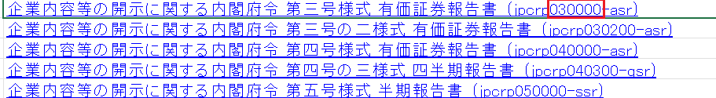

# 有価証券報告書以外の書類の集め方

有価証券報告書以外の書類を自動で集める際には、ordinate_code, form_codeを変える必要があります。有価証券報告書を集めたい場合には、
ordinance_code == 010, form_code == 030000 を指定しました。

以下の表であるようにほかの一般的なEDINETの書類は以下のような組み合わせで取得できるようになっています。

| 書類名             | ordinance_code | form_code |
| ------------------ | -------------- | --------- |
| 四半期報告書       | 010            | 043000    |
| 半期報告書         | 010            | 050000    |
| 訂正有価証券報告書 | 010            | 030001    |

これらの情報はordinance_codeを書類に適用された内閣府令で、form_codeを内閣府令の何号様式かで判断しています。

引用：EDINET API仕様書（version2）p85

引用：https://www.fsa.go.jp/search/20231211.htmlよりタクソノミ要素リスト.xlsx

またこれら書類のタクソノミは、書類ごとに記述される内容も異なるためタクソノミも異なるものが設定されています。

書類ごとに2章で紹介した方法を用いてしっかりタクソノミを調べるようにしましょう。
